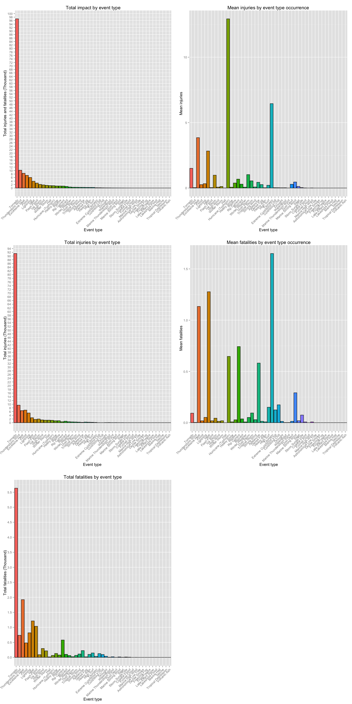
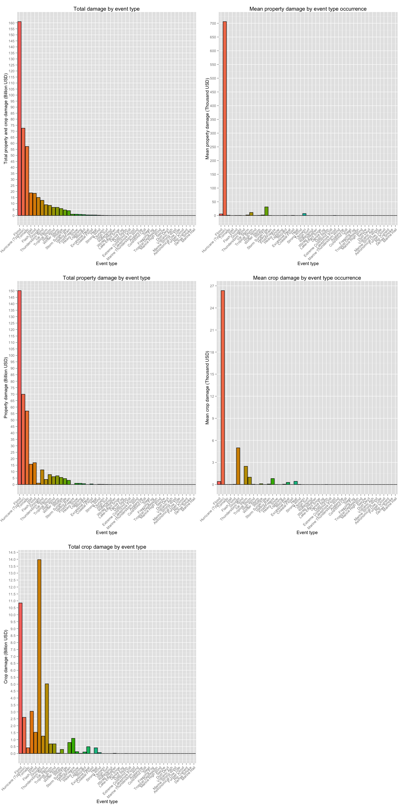

# Severe storm events and their impact on population health and the economy of the United States (1950 - 2011)
Elmar Langholz  
March 21, 2015  

## Synopsis

The [NOAA's National Climatic Data Center (NCDC)](http://www.ncdc.noaa.gov/) is responsible for preserving, monitoring, assessing, and providing public access to the Nation's treasure of climate and historical weather data and information. Since 1950, it has been recording occurrence of storms and other significant weather phenomena having sufficient intensity to cause loss of life, injuries, significant property damage, and/or disruption to commerce. With the use of these recordings, we have analyzed the economical consequences as well as harmfulness to the populations of the different event types. With these we could potentially prioritize resources and plan ahead for future events that might occur in the United States. 

We have found that the most harmful event type overall that has impacted the populations health in the United States from 1950 to November 2011 is the **Tornado causing a total of both injuries and fatatilies in the order of one hundred thousand**. Analogously, we also discovered that (for the same period) the overall event type that has caused the greatest total economic damage has been the **Flood causing damages in the order of one hundred and sixty billion USD**. **While the event type that causes the highest fatalities on every occurrence (average) is the Tsunami, the event type that causes the highest number of injuries on every occurrence (average) is the Hurracaine (Typhoon)**. As a point in hand, **the event type that has the largest economic loss per occurrence (average) is the Hurricane (Typhoon)**.

## Data Processing

In order perform the data analysis, the first thing that we need to do is gain access to is the actual data and read it. NOAA's NCDC has publicly shared the [storm data set](https://d396qusza40orc.cloudfront.net/repdata%2Fdata%2FStormData.csv.bz2) which covers storm events from 1950 to the end of November 2011 and the registered data points. This is the data set that we will be leveraging.

### Loading libraries


```r
enforceInstallAndLoadPackage <- function (package) {
    if (!(package %in% rownames(installed.packages())) ) {
        install.packages(package, repos = "http://cran.rstudio.com/")
    }
    
    library(package, character.only = TRUE)
}

enforceInstallAndLoadPackage("plyr")
enforceInstallAndLoadPackage("ggplot2")
enforceInstallAndLoadPackage("stringr")
enforceInstallAndLoadPackage("stringdist")
enforceInstallAndLoadPackage("knitr")

# Multiple plot function (http://www.cookbook-r.com/Graphs/Multiple_graphs_on_one_page_(ggplot2)/)
#
# ggplot objects can be passed in ..., or to plotlist (as a list of ggplot objects)
# - cols:   Number of columns in layout
# - layout: A matrix specifying the layout. If present, 'cols' is ignored.
#
# If the layout is something like matrix(c(1,2,3,3), nrow=2, byrow=TRUE),
# then plot 1 will go in the upper left, 2 will go in the upper right, and
# 3 will go all the way across the bottom.
#
multiplot <- function(..., plotlist=NULL, file, cols=1, layout=NULL) {
  library(grid)

  # Make a list from the ... arguments and plotlist
  plots <- c(list(...), plotlist)

  numPlots = length(plots)

  # If layout is NULL, then use 'cols' to determine layout
  if (is.null(layout)) {
    # Make the panel
    # ncol: Number of columns of plots
    # nrow: Number of rows needed, calculated from # of cols
    layout <- matrix(seq(1, cols * ceiling(numPlots/cols)),
                    ncol = cols, nrow = ceiling(numPlots/cols))
  }

 if (numPlots==1) {
    print(plots[[1]])

  } else {
    # Set up the page
    grid.newpage()
    pushViewport(viewport(layout = grid.layout(nrow(layout), ncol(layout))))

    # Make each plot, in the correct location
    for (i in 1:numPlots) {
      # Get the i,j matrix positions of the regions that contain this subplot
      matchidx <- as.data.frame(which(layout == i, arr.ind = TRUE))

      print(plots[[i]], vp = viewport(layout.pos.row = matchidx$row,
                                      layout.pos.col = matchidx$col))
    }
  }
}
```

### Downloading the data if it is not present

The first thing to check before we can begin is whether or not we have the data locally in our disk. We do this for performance reasons (its faster to load data of the local disk than the network). In order to do this we can use the below function which will download and save the data if it is not present in our current directory. In the case that the data is already present, it just returns the name of the archive which contains it.

```r
downloadDataIfNotPresent <- function () {
    archiveName <- "./stormdata.csv.bz2"
    if (!file.exists(archiveName)) {
        url <- "https://d396qusza40orc.cloudfront.net/repdata%2Fdata%2FStormData.csv.bz2"
        download.file(url, archiveName, method = "curl")
    }
    
    archiveName
}

archiveName <- downloadDataIfNotPresent()
```

### Loading/reading the data into memory

Since the data is archived using the [bzip2](https://en.wikipedia.org/wiki/Bzip2) compression algorithm, we first establish a read-only connection to the archive and read the [comma-separated values](https://en.wikipedia.org/wiki/Comma-separated_values) file with the intent of having all the data handy. Finally, we close the connection since we no longer need it.

```r
bzipConnection <- bzfile(archiveName, "r")
data <- read.csv(bzipConnection)
close(bzipConnection)
rm(bzipConnection)
```

### Exploratory glance of the data

Having loaded the data in-memory, lets take a look at the structure to have a feeling for what we are dealing with.

```r
str(data)
```

```
## 'data.frame':	902297 obs. of  37 variables:
##  $ STATE__   : num  1 1 1 1 1 1 1 1 1 1 ...
##  $ BGN_DATE  : Factor w/ 16335 levels "1/1/1966 0:00:00",..: 6523 6523 4242 11116 2224 2224 2260 383 3980 3980 ...
##  $ BGN_TIME  : Factor w/ 3608 levels "00:00:00 AM",..: 272 287 2705 1683 2584 3186 242 1683 3186 3186 ...
##  $ TIME_ZONE : Factor w/ 22 levels "ADT","AKS","AST",..: 7 7 7 7 7 7 7 7 7 7 ...
##  $ COUNTY    : num  97 3 57 89 43 77 9 123 125 57 ...
##  $ COUNTYNAME: Factor w/ 29601 levels "","5NM E OF MACKINAC BRIDGE TO PRESQUE ISLE LT MI",..: 13513 1873 4598 10592 4372 10094 1973 23873 24418 4598 ...
##  $ STATE     : Factor w/ 72 levels "AK","AL","AM",..: 2 2 2 2 2 2 2 2 2 2 ...
##  $ EVTYPE    : Factor w/ 985 levels "   HIGH SURF ADVISORY",..: 834 834 834 834 834 834 834 834 834 834 ...
##  $ BGN_RANGE : num  0 0 0 0 0 0 0 0 0 0 ...
##  $ BGN_AZI   : Factor w/ 35 levels "","  N"," NW",..: 1 1 1 1 1 1 1 1 1 1 ...
##  $ BGN_LOCATI: Factor w/ 54429 levels ""," Christiansburg",..: 1 1 1 1 1 1 1 1 1 1 ...
##  $ END_DATE  : Factor w/ 6663 levels "","1/1/1993 0:00:00",..: 1 1 1 1 1 1 1 1 1 1 ...
##  $ END_TIME  : Factor w/ 3647 levels ""," 0900CST",..: 1 1 1 1 1 1 1 1 1 1 ...
##  $ COUNTY_END: num  0 0 0 0 0 0 0 0 0 0 ...
##  $ COUNTYENDN: logi  NA NA NA NA NA NA ...
##  $ END_RANGE : num  0 0 0 0 0 0 0 0 0 0 ...
##  $ END_AZI   : Factor w/ 24 levels "","E","ENE","ESE",..: 1 1 1 1 1 1 1 1 1 1 ...
##  $ END_LOCATI: Factor w/ 34506 levels ""," CANTON"," TULIA",..: 1 1 1 1 1 1 1 1 1 1 ...
##  $ LENGTH    : num  14 2 0.1 0 0 1.5 1.5 0 3.3 2.3 ...
##  $ WIDTH     : num  100 150 123 100 150 177 33 33 100 100 ...
##  $ F         : int  3 2 2 2 2 2 2 1 3 3 ...
##  $ MAG       : num  0 0 0 0 0 0 0 0 0 0 ...
##  $ FATALITIES: num  0 0 0 0 0 0 0 0 1 0 ...
##  $ INJURIES  : num  15 0 2 2 2 6 1 0 14 0 ...
##  $ PROPDMG   : num  25 2.5 25 2.5 2.5 2.5 2.5 2.5 25 25 ...
##  $ PROPDMGEXP: Factor w/ 19 levels "","-","?","+",..: 17 17 17 17 17 17 17 17 17 17 ...
##  $ CROPDMG   : num  0 0 0 0 0 0 0 0 0 0 ...
##  $ CROPDMGEXP: Factor w/ 9 levels "","?","0","2",..: 1 1 1 1 1 1 1 1 1 1 ...
##  $ WFO       : Factor w/ 542 levels ""," CI","%SD",..: 1 1 1 1 1 1 1 1 1 1 ...
##  $ STATEOFFIC: Factor w/ 250 levels "","ALABAMA, Central",..: 1 1 1 1 1 1 1 1 1 1 ...
##  $ ZONENAMES : Factor w/ 25112 levels "","                                                                                                                               "| __truncated__,..: 1 1 1 1 1 1 1 1 1 1 ...
##  $ LATITUDE  : num  3040 3042 3340 3458 3412 ...
##  $ LONGITUDE : num  8812 8755 8742 8626 8642 ...
##  $ LATITUDE_E: num  3051 0 0 0 0 ...
##  $ LONGITUDE_: num  8806 0 0 0 0 ...
##  $ REMARKS   : Factor w/ 436781 levels "","\t","\t\t",..: 1 1 1 1 1 1 1 1 1 1 ...
##  $ REFNUM    : num  1 2 3 4 5 6 7 8 9 10 ...
```

The data set consists of 902297 observations (rows) and 37 variables (columns).

In order to perform our analysis, out of all the provided rows we will use the following seven:


Column name     | Description                   
--------------- | ----------------------------------------
 EVTYPE         | The event type
 FATALITIES     | The number of fatalities for the event
 INJURIES       | The number of injuries for the event
 PROPDMG        | The property damage quantity
 PROPDMGEXP     | The property damage exponent
 CROPDMG        | The crop damage property
 CROPDMGEXP     | The crop damage exponent

 
To make it easier to manipulate the data, lets convert all the relevant factor variable to characters.

```r
data$EVTYPE <- as.character(data$EVTYPE)
data$PROPDMGEXP <- as.character(data$PROPDMGEXP)
data$CROPDMGEXP <- as.character(data$CROPDMGEXP)
```

#### Event Types

Lets first identify the types of storm events that we are going to be dealing with. The provided [storm data set documentation](https://d396qusza40orc.cloudfront.net/repdata%2Fpeer2_doc%2Fpd01016005curr.pdf), in *Section 2.1 (page 5)*, states that "*The only events permitted in Storm Data are listed in Table 1 of Section 2.1.1.*". The table consists of the following 48 events:

Event type(s)                   | Event type(s)              | Event type(s)                          
------------------------------- | -------------------------- | -----------------------------
1. Astronomical Low Tide        |  17. Funnel Cloud          |  33. Marine Thunderstorm Wind
2. Avalanche                    |  18. Freezing Fog          |  34. Rip Current
3. Blizzard                     |  19. Hail                  |  35. Seiche
4. Coastal Flood                |  20. Heat                  |  36. Sleet
5. Cold/Wind Chill              |  21. Heavy Rain            |  37. Storm Surge/Tide
6. Debris Flow                  |  22. Heavy Snow            |  38. Strong Wind
7. Dense Fog                    |  23. High Surf             |  39. Thunderstorm Wind
8. Dense Smoke                  |  24. High Wind             |  40. Tornado
9. Drought                      |  25. Hurricane (Typhoon)   |  41. Tropical Depression
10. Dust Devil                  |  26. Ice Storm             |  42. Tropical Storm
11. Dust Storm                  |  27. Lake-Effect Snow      |  43. Tsunami
12. Excessive Heat              |  28. Lakeshore Flood       |  44. Volcanic Ash
13. Extreme Cold/Wind Chill     |  29. Lightning             |  45. Waterspout
14. Flash Flood                 |  30. Marine Hail           |  46. Wildfire
15. Flood                       |  31. Marine High Wind      |  47. Winter Storm
16. Frost/Freeze                |  32. Marine Strong Wind    |  48. Winter Weather

However, taking a look at the data set's *EVTYPE* variable we are able to determine that in reality this constraint does not apply since it shows that the variable is a character containing 985 unique values.

Diving deeper into the atual event types by taking the first 48 events we can identify that the data is actually dirty and non-standarized.

```r
head(unique(data$EVTYPE), 48)
```

```
##  [1] "TORNADO"                        "TSTM WIND"                     
##  [3] "HAIL"                           "FREEZING RAIN"                 
##  [5] "SNOW"                           "ICE STORM/FLASH FLOOD"         
##  [7] "SNOW/ICE"                       "WINTER STORM"                  
##  [9] "HURRICANE OPAL/HIGH WINDS"      "THUNDERSTORM WINDS"            
## [11] "RECORD COLD"                    "HURRICANE ERIN"                
## [13] "HURRICANE OPAL"                 "HEAVY RAIN"                    
## [15] "LIGHTNING"                      "THUNDERSTORM WIND"             
## [17] "DENSE FOG"                      "RIP CURRENT"                   
## [19] "THUNDERSTORM WINS"              "FLASH FLOOD"                   
## [21] "FLASH FLOODING"                 "HIGH WINDS"                    
## [23] "FUNNEL CLOUD"                   "TORNADO F0"                    
## [25] "THUNDERSTORM WINDS LIGHTNING"   "THUNDERSTORM WINDS/HAIL"       
## [27] "HEAT"                           "WIND"                          
## [29] "LIGHTING"                       "HEAVY RAINS"                   
## [31] "LIGHTNING AND HEAVY RAIN"       "FUNNEL"                        
## [33] "WALL CLOUD"                     "FLOODING"                      
## [35] "THUNDERSTORM WINDS HAIL"        "FLOOD"                         
## [37] "COLD"                           "HEAVY RAIN/LIGHTNING"          
## [39] "FLASH FLOODING/THUNDERSTORM WI" "WALL CLOUD/FUNNEL CLOUD"       
## [41] "THUNDERSTORM"                   "WATERSPOUT"                    
## [43] "EXTREME COLD"                   "HAIL 1.75)"                    
## [45] "LIGHTNING/HEAVY RAIN"           "HIGH WIND"                     
## [47] "BLIZZARD"                       "BLIZZARD WEATHER"
```

#### Fatalities and injuries

Since fatalities and injuries (see Page 9 of the [storm data set documentation](https://d396qusza40orc.cloudfront.net/repdata%2Fpeer2_doc%2Fpd01016005curr.pdf)) are both numerical values, it makes sense that these have the following range: [0, MAX]. It is illogical to have negative fatalities or injuries, so lets validate that our data set complies with this assumption.


```r
sum(data$FATALITIES < 0)
```

```
## [1] 0
```


```r
sum(data$INURIES < 0)
```

```
## [1] 0
```

This validates our assumption, so we don't really need to do anything further on these.

#### Property and crop damage

Since the property and crop damage (see Page 12 of the [storm data set documentation](https://d396qusza40orc.cloudfront.net/repdata%2Fpeer2_doc%2Fpd01016005curr.pdf)) are both numerical values it makes sense that these have the following range: [0, MAX]. Since its illogical to have negative property or crop damage, lets validate that our data set complies with this assumption.


```r
sum(data$PROPDMG < 0)
```

```
## [1] 0
```


```r
sum(data$CROPDMG < 0)
```

```
## [1] 0
```

This validates our assumption, so we don't really need to do anything further on these.

#### Property and crop damage exponents

The property and crop damage exponents are qualifiers that determine the actual quantity representing their corresponding damage value. Here are the actual values:


```r
sort(unique(data$PROPDMGEXP))
```

```
##  [1] ""  "-" "?" "+" "0" "1" "2" "3" "4" "5" "6" "7" "8" "B" "h" "H" "K"
## [18] "m" "M"
```


```r
sort(unique(data$CROPDMGEXP))
```

```
## [1] ""  "?" "0" "2" "B" "k" "K" "m" "M"
```

While most of the exponents are using [short scale](https://en.wikipedia.org/wiki/Long_and_short_scales) [metric prefix symbols](https://en.wikipedia.org/wiki/Metric_prefix) to indicate the the actual scale of the referenced value, the following scale value(s) are uknown: "",  "?", "0", "1", "2", "3", "4", "5", "6", "7", "8", "-", "+".

Due to the lack of documentation, in order to determine the actual scale for which they correspond, we can search for an instance of each in our observations and take a look at the way that the NCDC NOAA [website](http://www.ncdc.noaa.gov/stormevents/choosedates.jsp?statefips=-999%2CALL#) resolved these. At the writing of this anlaysis the [latest](http://www.ncdc.noaa.gov/stormevents/versions.jsp) was Version 3.0 (May 12, 2014).

##### Empty chatacter ("")

Searching the data set for observations in whose exponent is an empty character and damage value is larger than zero:

```r
indexes <- which((data$PROPDMGEXP == "") & (data$PROPDMG > 0))
if (length(indexes) > 0) {
    matchingObservations <- unique(data[indexes, c("EVTYPE", "PROPDMG", "PROPDMGEXP")])
    print(matchingObservations)
    data[indexes, ][which(data[indexes, ]$EVTYPE == "TORNADO")[1], ]
} else {
    print("No observations found that comply with constraint with respect to property damage")
}
```

```
##                         EVTYPE PROPDMG PROPDMGEXP
## 192467       FLASH FLOOD WINDS    0.41           
## 196196                 TORNADO    3.00           
## 196687       THUNDERSTORM WIND    2.00           
## 196961      THUNDERSTORM WINDS    4.00           
## 199706             FLASH FLOOD   10.00           
## 202691      THUNDERSTORM WINDS    5.00           
## 202709                    HAIL   10.00           
## 202710                    HAIL   35.00           
## 204733             FLASH FLOOD   75.00           
## 205444      THUNDERSTORM WINDS    3.00           
## 206515      THUNDERSTORM WINDS    1.00           
## 211429      THUNDERSTORM WINDS   20.00           
## 212172      THUNDERSTORM WINDS    2.00           
## 218919      HEAVY SNOW SQUALLS   10.00           
## 221940                    HAIL    1.00           
## 222022             FLASH FLOOD   20.00           
## 222148             FLASH FLOOD    5.00           
## 222150             FLASH FLOOD    4.00           
## 222200 THUNDERSTORM WINDS HAIL    6.00           
## 222214             FLASH FLOOD    7.00           
## 222447      THUNDERSTORM WINDS    9.00           
## 222510      THUNDERSTORM WINDS    8.00           
## 222572             FLASH FLOOD    8.00           
## 222576      THUNDERSTORM WINDS    6.00           
## 222581             FLASH FLOOD    3.00           
## 222651      THUNDERSTORM WINDS    7.00           
## 222709 THUNDERSTORM WINDS HAIL    4.00           
## 223089 THUNDERSTORM WINDS HAIL   10.00           
## 223214                    HAIL    5.00           
## 223447              HIGH WINDS    3.00           
## 223531                   FLOOD    4.00           
## 223642                   FLOOD    3.00           
## 223738             FLASH FLOOD    2.00           
## 228472                    HAIL    2.00           
## 232662          FLASH FLOODING    4.00           
## 239654                    HAIL    3.00           
## 242967       FLASH FLOOD/FLOOD    6.00           
## 246030               LIGHTNING    3.00
```

```
##        STATE__         BGN_DATE BGN_TIME TIME_ZONE COUNTY COUNTYNAME STATE
## 196196      12 1/8/1993 0:00:00     1130       EST    125      UNION    FL
##         EVTYPE BGN_RANGE BGN_AZI  BGN_LOCATI END_DATE END_TIME COUNTY_END
## 196196 TORNADO        24       N Gainesville                            0
##        COUNTYENDN END_RANGE END_AZI END_LOCATI LENGTH WIDTH F MAG
## 196196         NA         0                       0.1    10 0   0
##        FATALITIES INJURIES PROPDMG PROPDMGEXP CROPDMG CROPDMGEXP WFO
## 196196          0        0       3                  0               
##        STATEOFFIC ZONENAMES LATITUDE LONGITUDE LATITUDE_E LONGITUDE_
## 196196                          3003      8219          0          0
##                                                                                                                     REMARKS
## 196196 A small tornado touched down at the North Florida Prison Reception Center damaging the building before dissipating. 
##        REFNUM
## 196196 196182
```

```r
indexes <- which((data$CROPDMGEXP == "") & (data$CROPDMG > 0))
if (length(indexes) > 0) {
    matchingObservations <- unique(data[indexes, c("EVTYPE", "CROPDMG", "CROPDMGEXP")])
    print(matchingObservations)
    data[indexes, ][which(data[indexes, ]$EVTYPE == "HAIL")[1], ]
} else {
    print("No observations found that comply with constraint with respect to crop damage")
}
```

```
##                    EVTYPE CROPDMG CROPDMGEXP
## 221857               HAIL       3           
## 238757 THUNDERSTORM WINDS       4
```

```
##        STATE__         BGN_DATE BGN_TIME TIME_ZONE COUNTY COUNTYNAME STATE
## 221857      38 7/4/1994 0:00:00     0400       CST     93   STUTSMAN    ND
##        EVTYPE BGN_RANGE BGN_AZI BGN_LOCATI END_DATE END_TIME COUNTY_END
## 221857   HAIL         0          Jamestown                            0
##        COUNTYENDN END_RANGE END_AZI END_LOCATI LENGTH WIDTH  F MAG
## 221857         NA         0                         0     0 NA 175
##        FATALITIES INJURIES PROPDMG PROPDMGEXP CROPDMG CROPDMGEXP WFO
## 221857          0        0       5          K       3               
##        STATEOFFIC ZONENAMES LATITUDE LONGITUDE LATITUDE_E LONGITUDE_
## 221857                             0         0          0          0
##        REMARKS REFNUM
## 221857         221817
```

Searching the website for a matching observation:

* The property damage [search](http://www.ncdc.noaa.gov/stormevents/listevents.jsp?eventType=%28C%29+Tornado&beginDate_mm=01&beginDate_dd=08&beginDate_yyyy=1993&endDate_mm=01&endDate_dd=08&endDate_yyyy=1993&county=UNION%3A125&hailfilter=0.00&tornfilter=0&windfilter=000&sort=DT&submitbutton=Search&statefips=12%2CFLORIDA) yields the result that for that observation, the estimated property damage (PrD) is equal to zero.
* The crop damage [search](http://www.ncdc.noaa.gov/stormevents/listevents.jsp?eventType=%28C%29+Hail&beginDate_mm=07&beginDate_dd=04&beginDate_yyyy=1994&endDate_mm=07&endDate_dd=04&endDate_yyyy=1994&county=STUTSMAN%3A93&hailfilter=0.00&tornfilter=0&windfilter=000&sort=DT&submitbutton=Search&statefips=38%2CNORTH+DAKOTA) yields the result that for that observation the estimated crop damage (CrD) is equal to zero.

**Given these two observations, we can generalize the fact that we can set the numerical value (multiplier) to zero.**

##### Question mark ("?")

Searching the data set for observations in whose exponent is a question mark character and damage value is larger than zero:

```r
indexes <- which((data$PROPDMGEXP == "?") & (data$PROPDMG > 0))
if (length(indexes) > 0) {
    matchingObservations <- unique(data[indexes, c("EVTYPE", "PROPDMG", "PROPDMGEXP")])
    print(matchingObservations)
} else {
    print("No observations found that comply with constraint with respect to property damage")
}
```

```
## [1] "No observations found that comply with constraint with respect to property damage"
```

```r
indexes <- which((data$CROPDMGEXP == "?") & (data$CROPDMG > 0))
if (length(indexes) > 0) {
    matchingObservations <- unique(data[indexes, c("EVTYPE", "CROPDMG", "CROPDMGEXP")])
    print(matchingObservations)
} else {
    print("No observations found that comply with constraint with respect to crop damage")
}
```

```
## [1] "No observations found that comply with constraint with respect to crop damage"
```

**Given that there are no observations, we can generalize the fact that we can set the numerical value (multiplier) to zero.**

##### Minus ("-")

Searching the data set for observations in whose exponent is a minus character and damage value is larger than zero:

```r
indexes <- which((data$PROPDMGEXP == "-") & (data$PROPDMG > 0))
if (length(indexes) > 0) {
    matchingObservations <- unique(data[indexes, c("EVTYPE", "PROPDMG", "PROPDMGEXP")])
    print(matchingObservations)
    data[indexes, ][which(data[indexes, ]$EVTYPE == "HIGH WIND")[1], ]
} else {
    print("No observations found that comply with constraint with respect to property damage")
}
```

```
##           EVTYPE PROPDMG PROPDMGEXP
## 229327 HIGH WIND      15          -
```

```
##        STATE__           BGN_DATE BGN_TIME TIME_ZONE COUNTY
## 229327      41 12/12/1995 0:00:00     1000       PST      0
##                        COUNTYNAME STATE    EVTYPE BGN_RANGE BGN_AZI
## 229327 ORZ004 - 05 - 06 - 08 - 09    OR HIGH WIND         0        
##        BGN_LOCATI           END_DATE END_TIME COUNTY_END COUNTYENDN
## 229327            12/12/1995 0:00:00     2000          0         NA
##        END_RANGE END_AZI END_LOCATI LENGTH WIDTH  F MAG FATALITIES
## 229327         0                         0     0 NA   0          2
##        INJURIES PROPDMG PROPDMGEXP CROPDMG CROPDMGEXP WFO STATEOFFIC
## 229327        0      15          -       0                          
##                                                                                                                                            ZONENAMES
## 229327 CENTRAL COAST RANGE OF W OREGO - CENTRAL COAST RANGE OF W OREGO - LOWER COLUMBIA - GREATER PORTLAND METRO AREA - WESTERN COLUMBIA RIVER GORGE
##        LATITUDE LONGITUDE LATITUDE_E LONGITUDE_
## 229327        0         0          0          0
##                                                                                                                                                                                                                                                                                                                                                                                                                                                                                                                                                                                                                                                                                                                                                                                                                  REMARKS
## 229327 The massive storm that produced high winds on the coast spread strong and damaging winds to most of Oregon as it moved northward offshore during the day of the 12th.  Two people were killed, and widespread damage occurred due to falling trees.  Power was out for over a day at many locations.  Highest reported wind gusts included 74 mph at Portland, with wind blowing out windows downtown, Beaverton and Canby 65 mph, Dallas 60 mph, Troutdale and Salem 58 mph, Cave Junction 64 mph, and Bend sustained 45 mph winds with trees blown down near LaPine. A Forest Grove woman died when a tree fell onto the car she was driving, and a Beavercreek woman died from head injuries when she was knocked down by a livestock gate she was opening that was caught by a strong wind gust. F51V, F53O. 
##        REFNUM
## 229327 229314
```

```r
indexes <- which((data$CROPDMGEXP == "-") & (data$CROPDMG > 0))
if (length(indexes) > 0) {
    matchingObservations <- unique(data[indexes, c("EVTYPE", "CROPDMG", "CROPDMGEXP")])
    print(matchingObservations)
} else {
    print("No observations found that comply with constraint with respect to crop damage")
}
```

```
## [1] "No observations found that comply with constraint with respect to crop damage"
```

Searching the website for a matching observation:

* The property damage search yielded no results.

**Given that there are no matching search website results for the property damage constraint and there are no crop damage observations,we can generalize the fact that we can set the numerical value (multiplier) to zero.**

##### Plus ("+")

Searching the data set for observations in whose exponent is a plus character and damage value is larger than zero:

```r
indexes <- which((data$PROPDMGEXP == "+") & (data$PROPDMG > 0))
if (length(indexes) > 0) {
    matchingObservations <- unique(data[indexes, c("EVTYPE", "PROPDMG", "PROPDMGEXP")])
    print(matchingObservations)
    data[indexes, ][which(data[indexes, ]$EVTYPE == "TORNADO")[1], ]
} else {
    print("No observations found that comply with constraint with respect to property damage")
}
```

```
##                     EVTYPE PROPDMG PROPDMGEXP
## 188780    BREAKUP FLOODING      20          +
## 189001           HIGH WIND      20          +
## 192262 FLOODING/HEAVY RAIN       2          +
## 216755          HIGH WINDS      15          +
## 216802             TORNADO      60          +
```

```
##        STATE__         BGN_DATE BGN_TIME TIME_ZONE COUNTY
## 216802      32 6/5/1995 0:00:00     1304       PDT      0
##                COUNTYNAME STATE  EVTYPE BGN_RANGE BGN_AZI      BGN_LOCATI
## 216802 NVZ003 - 004 - 007    NV TORNADO         0         Extreme Western
##                END_DATE END_TIME COUNTY_END COUNTYENDN END_RANGE END_AZI
## 216802 6/5/1995 0:00:00  1330PDT          0         NA         0        
##        END_LOCATI LENGTH WIDTH  F MAG FATALITIES INJURIES PROPDMG
## 216802               0.5   300 NA   0          0        0      60
##        PROPDMGEXP CROPDMG CROPDMGEXP WFO STATEOFFIC
## 216802          +       0                          
##                                                                                                                                ZONENAMES
## 216802 GREATER RENO / CARSON CITY / M - GREATER RENO / CARSON CITY / M - WESTERN NEVADA BASIN AND RANGE - WESTERN NEVADA BASIN AND RANGE
##        LATITUDE LONGITUDE LATITUDE_E LONGITUDE_
## 216802        0         0          0          0
##                                                                                                                                                                                                                                                                                                                                                                                                                                                                                                                                                                                                                                                                                                                                                                                                   REMARKS
## 216802 Nevada, West- ,,,,,,,,,,,,,,,Funnel Clouds Central Nevada,,,,,,,,,,High Winds East-Central Nevada,A strong cold front stretching from northeast Nevada into south-central Nevada triggered a tornado in the Silver Springs area.  The tornado was reported on the ground by the Nevada Office of Emergency Management at 1300 PDT.  It stayed on the ground for several hundred yards and then lifted again.  In its path three mobile homes were damaged, one was destroyed, power lines were downed and at least 12 homes were damaged.  Several trees were uprooted and fences downed.  A funnel cloud was also spotted in west Carson City moving towards Dayton.  Farther along the front, winds gusted to 61 mph at Ely where siding was blown off some houses and power lines were downed. 
##        REFNUM
## 216802 216709
```

```r
indexes <- which((data$CROPDMGEXP == "+") & (data$CROPDMG > 0))
if (length(indexes) > 0) {
    matchingObservations <- unique(data[indexes, c("EVTYPE", "CROPDMG", "CROPDMGEXP")])
    print(matchingObservations)
} else {
    print("No observations found that comply with constraint with respect to crop damage")
}
```

```
## [1] "No observations found that comply with constraint with respect to crop damage"
```

Searching the website for a matching observation:

* The property damage [search](http://www.ncdc.noaa.gov/stormevents/listevents.jsp?eventType=ALL&beginDate_mm=06&beginDate_dd=05&beginDate_yyyy=1995&endDate_mm=06&endDate_dd=05&endDate_yyyy=1995&county=ALL&hailfilter=0.00&tornfilter=0&windfilter=000&sort=DT&submitbutton=Search&statefips=32%2CNEVADA) yields the result that for that observation, the estimated property damage (PrD) is equal to 0.06K or 60.

**Given that there are no matching search website results for the crop damage constraint and the property damage observation value equals the existing value, we can generalize the fact that we can set the numerical value (multiplier) to one.**

##### Single digit number values ([0-8])

Searching the data set for observations in whose exponent is a digit character and damage value is larger than zero:

```r
indexes <- which((data$PROPDMGEXP == "2") & (data$PROPDMG > 0))
if (length(indexes) > 0) {
    matchingObservations <- unique(data[indexes, c("EVTYPE", "PROPDMG", "PROPDMGEXP")])
    print(matchingObservations)
    data[indexes, ][which(data[indexes, ]$EVTYPE == "THUNDERSTORM WIND")[1], ]
} else {
    print("No observations found that comply with constraint with respect to property damage")
}
```

```
##                   EVTYPE PROPDMG PROPDMGEXP
## 212832 THUNDERSTORM WIND      12          2
```

```
##        STATE__         BGN_DATE BGN_TIME TIME_ZONE COUNTY COUNTYNAME STATE
## 212832      29 6/8/1995 0:00:00     0459       CST     27   CALLAWAY    MO
##                   EVTYPE BGN_RANGE BGN_AZI BGN_LOCATI END_DATE END_TIME
## 212832 THUNDERSTORM WIND         1      NE   Shamrock                  
##        COUNTY_END COUNTYENDN END_RANGE END_AZI END_LOCATI LENGTH WIDTH  F
## 212832          0         NA         0                         0     0 NA
##        MAG FATALITIES INJURIES PROPDMG PROPDMGEXP CROPDMG CROPDMGEXP WFO
## 212832   0          0        0      12          2       0               
##        STATEOFFIC ZONENAMES LATITUDE LONGITUDE LATITUDE_E LONGITUDE_
## 212832                             0         0          0          0
##                                                                                                                REMARKS
## 212832 Wind gusts reached 60 mph in Fulton and a mobile home was heavily damaged in the northeast part of the county. 
##        REFNUM
## 212832 212751
```

```r
indexes <- which((data$CROPDMGEXP == "0") & (data$CROPDMG > 0))
if (length(indexes) > 0) {
    matchingObservations <- unique(data[indexes, c("EVTYPE", "CROPDMG", "CROPDMGEXP")])
    print(matchingObservations)
    data[indexes, ][which(data[indexes, ]$EVTYPE == "TORNADO")[1], ]
} else {
    print("No observations found that comply with constraint with respect to crop damage")
}
```

```
##                    EVTYPE CROPDMG CROPDMGEXP
## 196458               HAIL      20          0
## 200544 THUNDERSTORM WINDS       5          0
## 200888            TORNADO      50          0
## 201146 THUNDERSTORM WINDS      25          0
## 201917            TORNADO      60          0
```

```
##        STATE__          BGN_DATE BGN_TIME TIME_ZONE COUNTY COUNTYNAME
## 200888      19 5/27/1995 0:00:00     1901       CST     47   CRAWFORD
##        STATE  EVTYPE BGN_RANGE BGN_AZI  BGN_LOCATI END_DATE END_TIME
## 200888    IA TORNADO         3      SW Westside to           1905CST
##        COUNTY_END COUNTYENDN END_RANGE END_AZI END_LOCATI LENGTH WIDTH F
## 200888          0         NA       0.5       W   Westside    2.5    50 1
##        MAG FATALITIES INJURIES PROPDMG PROPDMGEXP CROPDMG CROPDMGEXP WFO
## 200888   0          0        0     100          K      50          0    
##        STATEOFFIC ZONENAMES LATITUDE LONGITUDE LATITUDE_E LONGITUDE_
## 200888                             0         0          0          0
##        REMARKS REFNUM
## 200888         200854
```

Searching the website for a matching observation:

* The property damage [search](http://www.ncdc.noaa.gov/stormevents/listevents.jsp?eventType=%28C%29+Thunderstorm+Wind&beginDate_mm=06&beginDate_dd=08&beginDate_yyyy=1995&endDate_mm=06&endDate_dd=08&endDate_yyyy=1995&county=CALLAWAY%3A27&hailfilter=0.00&tornfilter=0&windfilter=000&sort=DT&submitbutton=Search&statefips=29%2CMISSOURI) yields the result that for that observation, the estimated property damage (PrD) is equal to 0.12K or 120.
* The crop damage [search](http://www.ncdc.noaa.gov/stormevents/listevents.jsp?eventType=%28C%29+Tornado&beginDate_mm=05&beginDate_dd=27&beginDate_yyyy=1995&endDate_mm=05&endDate_dd=27&endDate_yyyy=1995&county=CRAWFORD%3A47&hailfilter=0.00&tornfilter=0&windfilter=000&sort=DT&submitbutton=Search&statefips=19%2CIOWA) yields the result that for that observation the estimated crop damage (CrD) is equal to 0.50K or 500.

**Given these two observations, we can generalize the fact that we can set the numerical value (multiplier) to 10.**

### Data cleaning

Since we have identified that the raw data is actually dirty with (respect to the event types since it doesn't confirm to the specified documentation) and has not been normalized (in the case of the property and crop damage), we will have to perform some data cleaning to be able to map the observations containing the dirty event types to the permitted event types if possible.

#### Subsetting data

Since we will concentrate on the economic and population health impact, lets go ahead and subset the data so that we only keep in memory that which we will need.

```r
columns <- c("EVTYPE", "FATALITIES", "INJURIES", "PROPDMG", "PROPDMGEXP", "CROPDMG", "CROPDMGEXP")
data <- data[, columns]
```

#### Event types

As it stands, there are 985 different event type values compared to the documented 48. Since we are dealing with a lot more events than expected and we really don't want to miss from use a lot of existing data already recollected, we need to use several strategies to be able to reduce these and have a larger set of observations. Now, its likely that we could have gotten away with not doing any data cleaning for the event types in which case we could be talking about the subset of the data. Since we already have it, lets see if we can reduce the total amount.

##### Normalizing event type names

One of the first strategies that we can use to clean the data up is to normalize the event type names. 
We will proceed to do the following:

1. Upper-case all the names.
2. Replace back slashes, forward slashes and/or numbers with a space.
3. Substitute invalid/special characters for a space.
4. Collapse multiple contigous spaces into a single space.
5. Trim spaces, new lines or tabulations from the start and end of the names.


```r
normalizeEventTypes <- function (eventTypes) {
    eventTypes <- toupper(eventTypes)
    eventTypes <- str_replace_all(eventTypes, "[/\\]", " ")
    eventTypes <- str_replace_all(eventTypes, "[0-9]", " ")
    eventTypes <- str_replace_all(eventTypes, "[?:;.,()?!@#$%^&*+=_-]", " ")
    eventTypes <- str_replace_all(eventTypes, "[ ]{2,}", " ")
    eventTypes <- str_trim(eventTypes)
    eventTypes
}

data$EVTYPE <- normalizeEventTypes(data$EVTYPE)
```

**Number of unique values after normalization: 714**

##### Cleaning dirty events types

After normalizing the event type names, we are able to identify that there there are the following types of issues with the event type values:

1. Words with an extra suffix (as in terminators like ed, ing, s, etc...)
2. Abbreviations, acronyms and/or synonyms
3. Typos or simple mispelled words
4. Mixed event type names (containing two or more permitted values)
5. Incorrectly ordered event type names (words are swaped or contain prefix, intermediate or suffix words)

###### Removing words with an extra suffix

First, we construct the permitted event type name values and strip any word suffixes through [stemming](https://en.wikipedia.org/wiki/Stemming) by using a simple [suffix-stripping](https://en.wikipedia.org/wiki/Stemming#Suffix-stripping_algorithms).

```r
createDefinedEventTypes <- function () {
    definedEventTypes <-
    "1. Astronomical Low Tide        |  17. Funnel Cloud          |  33. Marine Thunderstorm Wind
    2. Avalanche                    |  18. Freezing Fog          |  34. Rip Current
    3. Blizzard                     |  19. Hail                  |  35. Seiche
    4. Coastal Flood                |  20. Heat                  |  36. Sleet
    5. Cold/Wind Chill              |  21. Heavy Rain            |  37. Storm Surge/Tide
    6. Debris Flow                  |  22. Heavy Snow            |  38. Strong Wind
    7. Dense Fog                    |  23. High Surf             |  39. Thunderstorm Wind
    8. Dense Smoke                  |  24. High Wind             |  40. Tornado
    9. Drought                      |  25. Hurricane (Typhoon)   |  41. Tropical Depression
    10. Dust Devil                  |  26. Ice Storm             |  42. Tropical Storm
    11. Dust Storm                  |  27. Lake-Effect Snow      |  43. Tsunami
    12. Excessive Heat              |  28. Lakeshore Flood       |  44. Volcanic Ash
    13. Extreme Cold/Wind Chill     |  29. Lightning             |  45. Waterspout
    14. Flash Flood                 |  30. Marine Hail           |  46. Wildfire
    15. Flood                       |  31. Marine High Wind      |  47. Winter Storm
    16. Frost/Freeze                |  32. Marine Strong Wind    |  48. Winter Weather"
    definedEventTypes <- strsplit(definedEventTypes, "[|\n]")
    definedEventTypes <- str_replace_all(definedEventTypes[[1]], "[.0-9]", "")
    definedEventTypes <- str_trim(definedEventTypes)
    definedEventTypes
}

permittedFromDefinedEventTypes <- function (definedEventTypes) {
    permittedEventTypes <- str_replace_all(definedEventTypes, "[()]", "")
    permittedEventTypes <- str_replace_all(permittedEventTypes, "[/-]", " ")
    permittedEventTypes <- str_trim(permittedEventTypes)
    permittedEventTypes <- toupper(permittedEventTypes)
    permittedEventTypes
}

stripSuffixes <- function (string) {
    if (length(string) > 0) {
        words <- strsplit(string, " ")
        words <- str_replace_all(words[[1]], "LY$", "")
        words <- str_replace_all(words, "S$", "")
        words <- str_replace_all(words, "ING$", "")
        words <- str_replace_all(words, "ED$", "")
        words <- str_replace_all(words, "E$", "")
        string <- paste(words, collapse = " ")
    }
    
    string
}

definedEventTypes <- createDefinedEventTypes()
permittedEventTypes <- permittedFromDefinedEventTypes(definedEventTypes)
permittedEventTypesWithoutSuffixes <- vapply(permittedEventTypes, stripSuffixes, FUN.VALUE = character(1))
```

Following are the permitted event type stemming updates:

```r
permittedEventTypeWords <- unlist(strsplit(permittedEventTypes, " "))
permittedEventTypeWordsWithoutSuffixes <- unlist(strsplit(permittedEventTypesWithoutSuffixes, " "))
updatedValues <- permittedEventTypeWords != permittedEventTypeWordsWithoutSuffixes
permittedEventTypesStemmingMap <- data.frame(value = permittedEventTypeWords[updatedValues], replacedWith = permittedEventTypeWordsWithoutSuffixes[updatedValues], row.names = NULL)
permittedEventTypesStemmingMap
```

```
##        value replacedWith
## 1       TIDE          TID
## 2     MARINE        MARIN
## 3  AVALANCHE     AVALANCH
## 4   FREEZING        FREEZ
## 5     SEICHE        SEICH
## 6      SURGE         SURG
## 7       TIDE          TID
## 8     DEBRIS        DEBRI
## 9      DENSE         DENS
## 10     DENSE         DENS
## 11     SMOKE         SMOK
## 12 HURRICANE     HURRICAN
## 13       ICE           IC
## 14      LAKE          LAK
## 15 EXCESSIVE     EXCESSIV
## 16 LAKESHORE     LAKESHOR
## 17   EXTREME       EXTREM
## 18 LIGHTNING       LIGHTN
## 19    MARINE        MARIN
## 20  WILDFIRE      WILDFIR
## 21    MARINE        MARIN
## 22    FREEZE        FREEZ
## 23    MARINE        MARIN
```

Then, to remove the extra suffixes of the words from the actual event types, we will reuse the previously defined function.

```r
eventTypesWithoutSuffixes <- vapply(data$EVTYPE, stripSuffixes, FUN.VALUE = character(1))
```

Following are the data event type stemming updates:

```r
findIndexOfFirstValue <- function (value, values) {
    index <- which(value == values)[1]
    index
}

updatedIndexes <- vapply(unique(data$EVTYPE[data$EVTYPE != eventTypesWithoutSuffixes]),
                         findIndexOfFirstValue,
                         FUN.VALUE = numeric(1),
                         data$EVTYPE)
eventTypesStemmingMap <- data.frame(value = data$EVTYPE[updatedIndexes], replacedWith = eventTypesWithoutSuffixes[updatedIndexes], row.names = NULL)
eventTypesStemmingMap <- unique(eventTypesStemmingMap)
eventTypesStemmingMap
```

```
##                              value                  replacedWith
## 1                    FREEZING RAIN                    FREEZ RAIN
## 2            ICE STORM FLASH FLOOD          IC STORM FLASH FLOOD
## 3                         SNOW ICE                       SNOW IC
## 4        HURRICANE OPAL HIGH WINDS       HURRICAN OPAL HIGH WIND
## 5               THUNDERSTORM WINDS             THUNDERSTORM WIND
## 6                   HURRICANE ERIN                 HURRICAN ERIN
## 7                   HURRICANE OPAL                 HURRICAN OPAL
## 8                        LIGHTNING                        LIGHTN
## 9                        DENSE FOG                      DENS FOG
## 10               THUNDERSTORM WINS              THUNDERSTORM WIN
## 11                  FLASH FLOODING                   FLASH FLOOD
## 12                      HIGH WINDS                     HIGH WIND
## 13    THUNDERSTORM WINDS LIGHTNING      THUNDERSTORM WIND LIGHTN
## 14         THUNDERSTORM WINDS HAIL        THUNDERSTORM WIND HAIL
## 15                        LIGHTING                         LIGHT
## 16                     HEAVY RAINS                    HEAVY RAIN
## 17        LIGHTNING AND HEAVY RAIN         LIGHTN AND HEAVY RAIN
## 18                        FLOODING                         FLOOD
## 19            HEAVY RAIN LIGHTNING             HEAVY RAIN LIGHTN
## 20  FLASH FLOODING THUNDERSTORM WI   FLASH FLOOD THUNDERSTORM WI
## 21                    EXTREME COLD                   EXTREM COLD
## 22            LIGHTNING HEAVY RAIN             LIGHTN HEAVY RAIN
## 23                BREAKUP FLOODING                 BREAKUP FLOOD
## 24                          FREEZE                         FREEZ
## 25        HIGH WIND AND HIGH TIDES        HIGH WIND AND HIGH TID
## 26  HIGH WIND BLIZZARD FREEZING RA   HIGH WIND BLIZZARD FREEZ RA
## 27                      HIGH TIDES                      HIGH TID
## 28         RECORD HIGH TEMPERATURE        RECORD HIGH TEMPERATUR
## 29          HIGH WINDS HEAVY RAINS          HIGH WIND HEAVY RAIN
## 30                       ICE STORM                      IC STORM
## 31       HIGH WINDS AND WIND CHILL      HIGH WIND AND WIND CHILL
## 32  HEAVY SNOW HIGH WINDS FREEZING    HEAVY SNOW HIGH WIND FREEZ
## 33          LOW TEMPERATURE RECORD         LOW TEMPERATUR RECORD
## 34                       AVALANCHE                      AVALANCH
## 35                   MARINE MISHAP                  MARIN MISHAP
## 36         HIGH TEMPERATURE RECORD        HIGH TEMPERATUR RECORD
## 37        RECORD HIGH TEMPERATURES        RECORD HIGH TEMPERATUR
## 38                  HIGH WIND SEAS                 HIGH WIND SEA
## 39           HIGH WINDS HEAVY RAIN          HIGH WIND HEAVY RAIN
## 40                       HIGH SEAS                      HIGH SEA
## 41               SEVERE TURBULENCE               SEVER TURBULENC
## 42                    EXTREME HEAT                   EXTREM HEAT
## 43                     WIND DAMAGE                    WIND DAMAG
## 44                   APACHE COUNTY                  APACH COUNTY
## 45                   FUNNEL CLOUDS                  FUNNEL CLOUD
## 46                    FLASH FLOODS                   FLASH FLOOD
## 47                  EXCESSIVE HEAT                 EXCESSIV HEAT
## 48  THUNDERSTORM WINDS FUNNEL CLOU THUNDERSTORM WIND FUNNEL CLOU
## 49         WINTER STORM HIGH WINDS        WINTER STORM HIGH WIND
## 50                     GUSTY WINDS                    GUSTY WIND
## 51                    STRONG WINDS                   STRONG WIND
## 52             FLOODING HEAVY RAIN              FLOOD HEAVY RAIN
## 53     HEAVY SURF COASTAL FLOODING      HEAVY SURF COASTAL FLOOD
## 54                  URBAN FLOODING                   URBAN FLOOD
## 55                    BLOWING DUST                     BLOW DUST
## 56                      WILD FIRES                      WILD FIR
## 57            URBAN SMALL FLOODING             URBAN SMALL FLOOD
## 58           HIGH WINDS DUST STORM          HIGH WIND DUST STORM
## 59                   WINTER STORMS                  WINTER STORM
## 60                       MUDSLIDES                       MUDSLID
## 61             SEVERE THUNDERSTORM            SEVER THUNDERSTORM
## 62            SEVERE THUNDERSTORMS            SEVER THUNDERSTORM
## 63       SEVERE THUNDERSTORM WINDS       SEVER THUNDERSTORM WIND
## 64             THUNDERSTORMS WINDS             THUNDERSTORM WIND
## 65                FLOOD RAIN WINDS               FLOOD RAIN WIND
## 66                           WINDS                          WIND
## 67                   THUNDERSTORMS                  THUNDERSTORM
## 68               FLASH FLOOD WINDS              FLASH FLOOD WIND
## 69     URBAN SMALL STREAM FLOODING      URBAN SMALL STREAM FLOOD
## 70                HIGH WIND DAMAGE               HIGH WIND DAMAG
## 71                 STREAM FLOODING                  STREAM FLOOD
## 72                             ICE                            IC
## 73                 DOWNBURST WINDS                DOWNBURST WIND
## 74            DRY MICROBURST WINDS           DRY MICROBURST WIND
## 75            DRY MIRCOBURST WINDS           DRY MIRCOBURST WIND
## 76                MICROBURST WINDS               MICROBURST WIND
## 77           HEAVY SNOW HIGH WINDS          HEAVY SNOW HIGH WIND
## 78                    BLOWING SNOW                     BLOW SNOW
## 79                FREEZING DRIZZLE                  FREEZ DRIZZL
## 80   LIGHTNING THUNDERSTORM WINDSS     LIGHTN THUNDERSTORM WINDS
## 81             HEAVY RAIN FLOODING              HEAVY RAIN FLOOD
## 82             THUNDERSTORM WINDSS            THUNDERSTORM WINDS
## 83                        TORNADOS                       TORNADO
## 84                           GLAZE                          GLAZ
## 85                COASTAL FLOODING                 COASTAL FLOOD
## 86                       HEAT WAVE                      HEAT WAV
## 87         FREEZING RAIN AND SLEET          FREEZ RAIN AND SLEET
## 88                UNSEASONABLY DRY                UNSEASONAB DRY
## 89                UNSEASONABLY WET                UNSEASONAB WET
## 90               UNSEASONABLY COLD               UNSEASONAB COLD
## 91             EXTREME RECORD COLD            EXTREM RECORD COLD
## 92         RIP CURRENTS HEAVY SURF        RIP CURRENT HEAVY SURF
## 93               UNSEASONABLY WARM               UNSEASONAB WARM
## 94             HIGH WINDS FLOODING               HIGH WIND FLOOD
## 95                     WATERSPOUTS                    WATERSPOUT
## 96                     STORM SURGE                    STORM SURG
## 97        TORNADOES TSTM WIND HAIL        TORNADO TSTM WIND HAIL
## 98    LIGHTNING THUNDERSTORM WINDS      LIGHTN THUNDERSTORM WIND
## 99                  MINOR FLOODING                   MINOR FLOOD
## 100               LIGHTNING INJURY                 LIGHTN INJURY
## 101 LIGHTNING AND THUNDERSTORM WIN   LIGHTN AND THUNDERSTORM WIN
## 102                       WILDFIRE                       WILDFIR
## 103                DAMAGING FREEZE                   DAMAG FREEZ
## 104                      HURRICANE                      HURRICAN
## 105               WILD FOREST FIRE               WILD FOREST FIR
## 106          SMALL STREAM FLOODING            SMALL STREAM FLOOD
## 107                      MUD SLIDE                      MUD SLID
## 108                      LIGNTNING                        LIGNTN
## 109             FREEZING RAIN SNOW               FREEZ RAIN SNOW
## 110                         FLOODS                         FLOOD
## 111            EXTREME WIND CHILLS             EXTREM WIND CHILL
## 112       SNOW SLEET FREEZING RAIN         SNOW SLEET FREEZ RAIN
## 113                    SEVERE COLD                    SEVER COLD
## 114                      GLAZE ICE                       GLAZ IC
## 115                      COLD WAVE                      COLD WAV
## 116                     EARLY SNOW                      EAR SNOW
## 117                     MUD SLIDES                      MUD SLID
## 118             EXTREME WIND CHILL             EXTREM WIND CHILL
## 119        COLD AND WET CONDITIONS        COLD AND WET CONDITION
## 120              EXCESSIVE WETNESS               EXCESSIV WETNES
## 121                 GRADIENT WINDS                 GRADIENT WIND
## 122        HEAVY SNOW BLOWING SNOW          HEAVY SNOW BLOW SNOW
## 123                SLEET ICE STORM                SLEET IC STORM
## 124 THUNDERSTORM WINDS URBAN FLOOD THUNDERSTORM WIND URBAN FLOOD
## 125 THUNDERSTORM WINDS SMALL STREA THUNDERSTORM WIND SMALL STREA
## 126            ROTATING WALL CLOUD              ROTAT WALL CLOUD
## 127               LARGE WALL CLOUD               LARG WALL CLOUD
## 128               COLD AIR FUNNELS               COLD AIR FUNNEL
## 129  BLOWING SNOW EXTREME WIND CHI     BLOW SNOW EXTREM WIND CHI
## 130            FREEZING RAIN SLEET              FREEZ RAIN SLEET
## 131               ICE JAM FLOODING                  IC JAM FLOOD
## 132                       ICE SNOW                       IC SNOW
## 133            THUNDERSTORM DAMAGE            THUNDERSTORM DAMAG
## 134              THUNDERTORM WINDS              THUNDERTORM WIND
## 135                     HAIL WINDS                     HAIL WIND
## 136                   SNOW AND ICE                   SNOW AND IC
## 137                    GRASS FIRES                      GRAS FIR
## 138                     LAKE FLOOD                     LAK FLOOD
## 139             SNOW AND ICE STORM             SNOW AND IC STORM
## 140             THUNDERSTORMS WIND             THUNDERSTORM WIND
## 141            AGRICULTURAL FREEZE            AGRICULTURAL FREEZ
## 142         DROUGHT EXCESSIVE HEAT         DROUGHT EXCESSIV HEAT
## 143    THUNDERSTORM WIND LIGHTNING      THUNDERSTORM WIND LIGHTN
## 144      HEAVY RAIN SEVERE WEATHER      HEAVY RAIN SEVER WEATHER
## 145              THUNDESTORM WINDS              THUNDESTORM WIND
## 146            WARM DRY CONDITIONS            WARM DRY CONDITION
## 147     HURRICANE GENERATED SWELLS        HURRICAN GENERAT SWELL
## 148           HEAVY SNOW ICE STORM           HEAVY SNOW IC STORM
## 149                  COASTAL SURGE                  COASTAL SURG
## 150       HEAVY SNOW AND ICE STORM       HEAVY SNOW AND IC STORM
## 151       HIGH WINDS COASTAL FLOOD       HIGH WIND COASTAL FLOOD
## 152                 RIVER FLOODING                   RIVER FLOOD
## 153                      ICE FLOES                        IC FLO
## 154                     HIGH WAVES                      HIGH WAV
## 155                   SNOW SQUALLS                   SNOW SQUALL
## 156                 LIGHTNING FIRE                    LIGHTN FIR
## 157         BLIZZARD FREEZING RAIN           BLIZZARD FREEZ RAIN
## 158                HEAVY LAKE SNOW                HEAVY LAK SNOW
## 159       HEAVY SNOW FREEZING RAIN         HEAVY SNOW FREEZ RAIN
## 160               LAKE EFFECT SNOW               LAK EFFECT SNOW
## 161  THUNDERSTORM WINDS HEAVY RAIN  THUNDERSTORM WIND HEAVY RAIN
## 162             THUNDERSTROM WINDS             THUNDERSTROM WIND
## 163      THUNDERSTORM WINDS LE CEN       THUNDERSTORM WIND L CEN
## 164             HEAVY SNOW AND ICE             HEAVY SNOW AND IC
## 165             ICE STORM AND SNOW             IC STORM AND SNOW
## 166     HEAVY SNOW ANDBLOWING SNOW       HEAVY SNOW ANDBLOW SNOW
## 167                 HEAVY SNOW ICE                 HEAVY SNOW IC
## 168 BLIZZARD AND EXTREME WIND CHIL BLIZZARD AND EXTREM WIND CHIL
## 169   BLOWING SNOW EXTREME WIND CH      BLOW SNOW EXTREM WIND CH
## 170      MUD SLIDES URBAN FLOODING          MUD SLID URBAN FLOOD
## 171           THUNDERSTORM WINDS G           THUNDERSTORM WIND G
## 172                GLAZE ICE STORM                 GLAZ IC STORM
## 173                       AVALANCE                       AVALANC
## 174          DUST STORM HIGH WINDS          DUST STORM HIGH WIND
## 175                        ICE JAM                        IC JAM
## 176                   FOREST FIRES                    FOREST FIR
## 177                   FROST FREEZE                   FROST FREEZ
## 178                    HARD FREEZE                    HARD FREEZ
## 179                      WILDFIRES                       WILDFIR
## 180               RECORD HEAT WAVE               RECORD HEAT WAV
## 181      HEAVY SNOW AND HIGH WINDS      HEAVY SNOW AND HIGH WIND
## 182    HEAVY SNOW HIGH WINDS FLOOD    HEAVY SNOW HIGH WIND FLOOD
## 183                  HAIL FLOODING                    HAIL FLOOD
## 184 THUNDERSTORM WINDS FLASH FLOOD THUNDERSTORM WIND FLASH FLOOD
## 185           FLOOD FLASH FLOODING             FLOOD FLASH FLOOD
## 186                 SNOW ICE STORM                 SNOW IC STORM
## 187                 EXCESSIVE RAIN                 EXCESSIV RAIN
## 188          RECORD EXCESSIVE HEAT          RECORD EXCESSIV HEAT
## 189                     HEAT WAVES                      HEAT WAV
## 190                    HAIL DAMAGE                    HAIL DAMAG
## 191               LIGHTNING DAMAGE                  LIGHTN DAMAG
## 192            RECORD TEMPERATURES             RECORD TEMPERATUR
## 193            LIGHTNING AND WINDS               LIGHTN AND WIND
## 194      FOG AND COLD TEMPERATURES       FOG AND COLD TEMPERATUR
## 195      FLASH FLOOD FROM ICE JAMS       FLASH FLOOD FROM IC JAM
## 196                       MUDSLIDE                       MUDSLID
## 197             HEAVY SNOW SQUALLS             HEAVY SNOW SQUALL
## 198                      ICY ROADS                      ICY ROAD
## 199             SNOW FREEZING RAIN               SNOW FREEZ RAIN
## 200            THUNDERSTORMW WINDS            THUNDERSTORMW WIND
## 201        THUNDERSTORM WIND TREES         THUNDERSTORM WIND TRE
## 202       THUNDERSTORM WIND AWNING         THUNDERSTORM WIND AWN
## 203                   RIP CURRENTS                   RIP CURRENT
## 204                HURRICANE EMILY                  HURRICAN EMI
## 205               HURRICANE GORDON               HURRICAN GORDON
## 206                HURRICANE FELIX                HURRICAN FELIX
## 207         THUNDERSTORM WINDS MPH         THUNDERSTORM WIND MPH
## 208         THUNDERSTORM WIND TREE         THUNDERSTORM WIND TRE
## 209         THUNDERSTORM DAMAGE TO         THUNDERSTORM DAMAG TO
## 210                    DAM FAILURE                    DAM FAILUR
## 211              LIGHTNING WAUSEON                LIGHTN WAUSEON
## 212              THUDERSTORM WINDS              THUDERSTORM WIND
## 213                   ICE AND SNOW                   IC AND SNOW
## 214              STORM FORCE WINDS               STORM FORC WIND
## 215         FREEZING RAIN AND SNOW           FREEZ RAIN AND SNOW
## 216        FREEZING RAIN SLEET AND          FREEZ RAIN SLEET AND
## 217  FREEZING DRIZZLE AND FREEZING        FREEZ DRIZZL AND FREEZ
## 218         THUNDERSTORM WINDS AND         THUNDERSTORM WIND AND
## 219                 HAIL ICY ROADS                 HAIL ICY ROAD
## 220   HEAVY RAIN URBAN FLOOD WINDS   HEAVY RAIN URBAN FLOOD WIND
## 221               TSTM WIND DAMAGE               TSTM WIND DAMAG
## 222                   SNOW SHOWERS                   SNOW SHOWER
## 223              HEAT WAVE DROUGHT              HEAT WAV DROUGHT
## 224  HEAVY SNOW BLIZZARD AVALANCHE  HEAVY SNOW BLIZZARD AVALANCH
## 225      UNSEASONABLY WARM AND DRY       UNSEASONAB WARM AND DRY
## 226  FREEZING RAIN SLEET AND LIGHT    FREEZ RAIN SLEET AND LIGHT
## 227      RECORD EXCESSIVE RAINFALL      RECORD EXCESSIV RAINFALL
## 228                LOW TEMPERATURE                LOW TEMPERATUR
## 229            SLEET FREEZING RAIN              SLEET FREEZ RAIN
## 230           HEAVY RAINS FLOODING              HEAVY RAIN FLOOD
## 231            THUNDERESTORM WINDS            THUNDERESTORM WIND
## 232    THUNDERSTORM WINDS FLOODING       THUNDERSTORM WIND FLOOD
## 233            THUNDEERSTORM WINDS            THUNDEERSTORM WIND
## 234               HIGHWAY FLOODING                 HIGHWAY FLOOD
## 235            THUNDERSTORM W INDS            THUNDERSTORM W IND
## 236              THUNERSTORM WINDS              THUNERSTORM WIND
## 237     HEAVY RAIN MUDSLIDES FLOOD      HEAVY RAIN MUDSLID FLOOD
## 238                 MUD ROCK SLIDE                 MUD ROCK SLID
## 239                HIGH WINDS COLD                HIGH WIND COLD
## 240                     COLD WINDS                     COLD WIND
## 241           RAPIDLY RISING WATER               RAPID RIS WATER
## 242                   EARLY FREEZE                     EAR FREEZ
## 243               ICE STRONG WINDS                IC STRONG WIND
## 244 EXTREME WIND CHILL BLOWING SNO    EXTREM WIND CHILL BLOW SNO
## 245                SNOW HIGH WINDS                SNOW HIGH WIND
## 246                HIGH WINDS SNOW                HIGH WIND SNOW
## 247                    EARLY FROST                     EAR FROST
## 248              SNOWMELT FLOODING                SNOWMELT FLOOD
## 249    HEAVY SNOW AND STRONG WINDS    HEAVY SNOW AND STRONG WIND
## 250 BLOWING SNOW EXTREME WIND CHIL    BLOW SNOW EXTREM WIND CHIL
## 251              SNOW BLOWING SNOW                SNOW BLOW SNOW
## 252                      TORNADOES                       TORNADO
## 253           FLASH FLOODING FLOOD             FLASH FLOOD FLOOD
## 254                FLASH FLOOODING                  FLASH FLOOOD
## 255             EXCESSIVE RAINFALL             EXCESSIV RAINFALL
## 256                     TSTM WINDS                     TSTM WIND
## 257                     HAILSTORMS                     HAILSTORM
## 258                        FUNNELS                        FUNNEL
## 259       THUNDERSTORM WINDS FLOOD       THUNDERSTORM WIND FLOOD
## 260                      LANDSLIDE                      LANDSLID
## 261             HIGH WIND AND SEAS             HIGH WIND AND SEA
## 262              THUNDERSTORMWINDS              THUNDERSTORMWIND
## 263                      EXCESSIVE                      EXCESSIV
## 264              WILD FOREST FIRES               WILD FOREST FIR
## 265                     HEAVY SEAS                     HEAVY SEA
## 266                    BRUSH FIRES                     BRUSH FIR
## 267        EXCESSIVE PRECIPITATION        EXCESSIV PRECIPITATION
## 268                     LANDSLIDES                      LANDSLID
## 269                  HEAVY SHOWERS                  HEAVY SHOWER
## 270                     BRUSH FIRE                     BRUSH FIR
## 271          URBAN FLOOD LANDSLIDE          URBAN FLOOD LANDSLID
## 272                   HEAVY SWELLS                   HEAVY SWELL
## 273                   URBAN FLOODS                   URBAN FLOOD
## 274          FLASH FLOOD LANDSLIDE          FLASH FLOOD LANDSLID
## 275          LANDSLIDE URBAN FLOOD          LANDSLID URBAN FLOOD
## 276         FLASH FLOOD LANDSLIDES          FLASH FLOOD LANDSLID
## 277              EXTREME WINDCHILL              EXTREM WINDCHILL
## 278             TEMPERATURE RECORD             TEMPERATUR RECORD
## 279            ICE JAM FLOOD MINOR            IC JAM FLOOD MINOR
## 280                MARINE ACCIDENT                MARIN ACCIDENT
## 281            LIGHT SNOW FLURRIES             LIGHT SNOW FLURRI
## 282                 TIDAL FLOODING                   TIDAL FLOOD
## 283                    RAIN DAMAGE                    RAIN DAMAG
## 284              UNSEASONABLE COLD              UNSEASONABL COLD
## 285                STREET FLOODING                  STREET FLOOD
## 286                        ICE FOG                        IC FOG
## 287                 EXCESSIVE COLD                 EXCESSIV COLD
## 288           LATE SEASON SNOWFALL           LAT SEASON SNOWFALL
## 289              HURRICANE EDOUARD              HURRICAN EDOUARD
## 290              RECORD WARM TEMPS              RECORD WARM TEMP
## 291                  EXTENDED COLD                   EXTEND COLD
## 292                   FREEZING FOG                     FREEZ FOG
## 293                  DRIFTING SNOW                    DRIFT SNOW
## 294                      LATE SNOW                      LAT SNOW
## 295             RECORD TEMPERATURE             RECORD TEMPERATUR
## 296                   MIXED PRECIP                    MIX PRECIP
## 297                      BLACK ICE                      BLACK IC
## 298                 FREEZING SPRAY                   FREEZ SPRAY
## 299                SUMMARY OF JUNE                SUMMARY OF JUN
## 300                   SUMMARY JUNE                   SUMMARY JUN
## 301                SUMMARY OF JULY                 SUMMARY OF JU
## 302                   SUMMARY JULY                    SUMMARY JU
## 303              NO SEVERE WEATHER              NO SEVER WEATHER
## 304                 EARLY SNOWFALL                  EAR SNOWFALL
## 305               MONTHLY SNOWFALL                MONTH SNOWFALL
## 306               MONTHLY RAINFALL                MONTH RAINFALL
## 307               COLD TEMPERATURE               COLD TEMPERATUR
## 308             MUDSLIDE LANDSLIDE              MUDSLID LANDSLID
## 309             VOLCANIC ASH PLUME             VOLCANIC ASH PLUM
## 310                           NONE                           NON
## 311                 BLOW OUT TIDES                  BLOW OUT TID
## 312              UNSEASONABLY COOL               UNSEASONAB COOL
## 313                    LATE FREEZE                     LAT FREEZ
## 314                  BLOW OUT TIDE                  BLOW OUT TID
## 315           HYPOTHERMIA EXPOSURE           HYPOTHERMIA EXPOSUR
## 316            MIXED PRECIPITATION             MIX PRECIPITATION
## 317        TSTM WIND AND LIGHTNING          TSTM WIND AND LIGHTN
## 318                 MOUNTAIN SNOWS                 MOUNTAIN SNOW
## 319                    HIGH SWELLS                    HIGH SWELL
## 320                     EARLY RAIN                      EAR RAIN
## 321                 PROLONGED RAIN                  PROLONG RAIN
## 322       COASTAL FLOODING EROSION         COASTAL FLOOD EROSION
## 323               UNSEASONABLY HOT                UNSEASONAB HOT
## 324                  WAKE LOW WIND                  WAK LOW WIND
## 325              COLD TEMPERATURES               COLD TEMPERATUR
## 326   COLD WIND CHILL TEMPERATURES    COLD WIND CHILL TEMPERATUR
## 327                  MODERATE SNOW                  MODERAT SNOW
## 328              MODERATE SNOWFALL              MODERAT SNOWFALL
## 329          URBAN STREET FLOODING            URBAN STREET FLOOD
## 330 BITTER WIND CHILL TEMPERATURES  BITTER WIND CHILL TEMPERATUR
## 331                         SEICHE                         SEICH
## 332         UNSEASONABLY WARM YEAR          UNSEASONAB WARM YEAR
## 333          HYPERTHERMIA EXPOSURE          HYPERTHERMIA EXPOSUR
## 334                     ROCK SLIDE                     ROCK SLID
## 335                    ICE PELLETS                     IC PELLET
## 336               PATCHY DENSE FOG               PATCHY DENS FOG
## 337               RED FLAG FIRE WX                 R FLAG FIR WX
## 338                EXCESSIVELY DRY                  EXCESSIV DRY
## 339     LIGHT SNOW FREEZING PRECIP       LIGHT SNOW FREEZ PRECIP
## 340          MONTHLY PRECIPITATION           MONTH PRECIPITATION
## 341            MONTHLY TEMPERATURE              MONTH TEMPERATUR
## 342                 RECORD DRYNESS                 RECORD DRYNES
## 343 EXTREME WINDCHILL TEMPERATURES   EXTREM WINDCHILL TEMPERATUR
## 344                 DRY CONDITIONS                 DRY CONDITION
## 345              REMNANTS OF FLOYD              REMNANT OF FLOYD
## 346               LATE SEASON HAIL               LAT SEASON HAIL
## 347                 EXCESSIVE SNOW                 EXCESSIV SNOW
## 348                        DRYNESS                        DRYNES
## 349                  WIND AND WAVE                  WIND AND WAV
## 350            LIGHT FREEZING RAIN              LIGHT FREEZ RAIN
## 351                      ICE ROADS                       IC ROAD
## 352                     ROUGH SEAS                     ROUGH SEA
## 353          UNSEASONABLY WARM WET           UNSEASONAB WARM WET
## 354          UNSEASONABLY COOL WET           UNSEASONAB COOL WET
## 355                 UNUSUALLY WARM                  UNUSUAL WARM
## 356                NON SEVERE HAIL                NON SEVER HAIL
## 357         NON SEVERE WIND DAMAGE          NON SEVER WIND DAMAG
## 358                 UNUSUALLY COLD                  UNUSUAL COLD
## 359             LOCALLY HEAVY RAIN              LOCAL HEAVY RAIN
## 360                     WIND GUSTS                     WIND GUST
## 361               LATE SEASON SNOW               LAT SEASON SNOW
## 362                GUSTY LAKE WIND                GUSTY LAK WIND
## 363                 ABNORMALLY DRY                  ABNORMAL DRY
## 364              RED FLAG CRITERIA               R FLAG CRITERIA
## 365          CSTL FLOODING EROSION            CSTL FLOOD EROSION
## 366                          SMOKE                          SMOK
## 367                  EXTREMELY WET                    EXTREM WET
## 368            UNUSUALLY LATE SNOW              UNUSUAL LAT SNOW
## 369                     ROGUE WAVE                      ROGU WAV
## 370           ACCUMULATED SNOWFALL            ACCUMULAT SNOWFALL
## 371               FALLING SNOW ICE                  FALL SNOW IC
## 372       GUSTY THUNDERSTORM WINDS       GUSTY THUNDERSTORM WIND
## 373                     PATCHY ICE                     PATCHY IC
## 374             HEAVY RAIN EFFECTS             HEAVY RAIN EFFECT
## 375         EXCESSIVE HEAT DROUGHT         EXCESSIV HEAT DROUGHT
## 376                NORTHERN LIGHTS                NORTHERN LIGHT
## 377               MARINE TSTM WIND               MARIN TSTM WIND
## 378                 HAZARDOUS SURF                 HAZARDOU SURF
## 379         ASTRONOMICAL HIGH TIDE         ASTRONOMICAL HIGH TID
## 380                 ABNORMALLY WET                  ABNORMAL WET
## 381                 TORNADO DEBRIS                 TORNADO DEBRI
## 382        EXTREME COLD WIND CHILL        EXTREM COLD WIND CHILL
## 383                    ICE ON ROAD                    IC ON ROAD
## 384                       DROWNING                         DROWN
## 385                    MARINE HAIL                    MARIN HAIL
## 386           HIGH SURF ADVISORIES            HIGH SURF ADVISORI
## 387              HURRICANE TYPHOON              HURRICAN TYPHOON
## 388               STORM SURGE TIDE                STORM SURG TID
## 389               MARINE HIGH WIND               MARIN HIGH WIND
## 390                    DENSE SMOKE                     DENS SMOK
## 391                LAKESHORE FLOOD                LAKESHOR FLOOD
## 392       MARINE THUNDERSTORM WIND       MARIN THUNDERSTORM WIND
## 393             MARINE STRONG WIND             MARIN STRONG WIND
## 394          ASTRONOMICAL LOW TIDE          ASTRONOMICAL LOW TID
```

```r
data$EVTYPE <- eventTypesWithoutSuffixes
rm(eventTypesStemmingMap)
```

**Number of unique values after stemming: 648**

###### Replacing abbreviations, acronyms and synonyms

The strategy that we will follow for fixing abbreviations, acronyms and synonyms is going to be a direct replacement. That is, we are going to find and replace words with other words that our intuition state that they are they same. 

```r
replaceAbbreviationsAcronymsAndSynonyms <- function (eventTypes) {
    eventTypes <- str_replace_all(eventTypes, fixed("TSTM"), "THUNDERSTORM")
    eventTypes <- str_replace_all(eventTypes, fixed("TSTMW"), "THUNDERSTORM")
    eventTypes <- str_replace_all(eventTypes, fixed("HVY"), "HEAVY")
    eventTypes <- str_replace_all(eventTypes, fixed("SML"), "SMALL")
    eventTypes <- str_replace_all(eventTypes, fixed("STRM"), "STREAM")
    eventTypes <- str_replace_all(eventTypes, fixed("DRY"), "DROUGHT")
    eventTypes <- str_replace_all(eventTypes, fixed("DRIEST"), "DROUGHT")
    eventTypes <- str_replace_all(eventTypes, fixed("DRYNES"), "DROUGHT")
    eventTypes <- str_replace_all(eventTypes, fixed("ASHFALL"), "ASH")
    eventTypes <- str_replace_all(eventTypes, "PRECIP$", "PRECIPITATION")
    eventTypes <- str_replace_all(eventTypes, fixed("PRECIPITATION"), "RAIN SNOW SLEET HAIL")
    eventTypes <- str_replace_all(eventTypes, "^TYPHOON$", "HURRICANE TYPHOON")
    eventTypes <- str_replace_all(eventTypes, fixed("CSTL"), "COASTAL")
    eventTypes
}

data$EVTYPE <- replaceAbbreviationsAcronymsAndSynonyms(data$EVTYPE)
```

**Number of unique values after replacing abbreviations, acronyms and synonyms: 636**

###### Resolving typos and simple spelling mistakes

The strategy that we will follow to resolve the typos and simple spelling mistakes is [approximate string matching](https://en.wikipedia.org/wiki/Approximate_string_matching) with replacement. That is we will search for the values that are a closest match to the permitted values or any of the valid words making them and replace them with the permitted if and only if the match is close enough.
We leverage the permitted event type values and its constructed words [n-grams](https://en.wikipedia.org/wiki/N-gram) to create the replacement table of known values. It is these values which we are going to approximately match, with a maximum distance of 1 while using the [Damerau-Levenshtein distance](https://en.wikipedia.org/wiki/Damerau%E2%80%93Levenshtein_distance), to the event types with the intent of using to replace the ones that match.

```r
removeTyposWithValues <- function (eventType, table) {
    cleanEventType <- eventType
    if (length(eventType) > 0) {
        indexMatch <- amatch(eventType, table, method = "dl", maxDist = 1)
        if (is.na(indexMatch)) {
            splitString <- unlist(strsplit(eventType, " "))
            splitString <- splitString[nchar(splitString) > 1]
            splitIndexMatches <- amatch(splitString, table, method = "dl", maxDist = 1)
            matchVector <- table[splitIndexMatches]
            matchVector[is.na(splitIndexMatches)] <- splitString[is.na(splitIndexMatches)]
            cleanEventType <- paste(matchVector, collapse = " ")
        } else {
            cleanEventType <- table[indexMatch]
        }
    }
    
    cleanEventType
}

removingTypos <- function (eventTypes, permittedEventTypesWithoutSuffixes) {
    splitPermittedEventTypeWords <- unique(permittedEventTypesWithoutSuffixes)
    knownWords <- c("ICY", "WILD", "MILD", "BLOW", "ON", "NO", "NON", "OF", "TO", "LAT", "GUST", "BELOW", "LIGHT")
    replacementTable <- unique(c(permittedEventTypesWithoutSuffixes, splitPermittedEventTypeWords, knownWords))
    replacedEventTypes <- vapply(data$EVTYPE, removeTyposWithValues, FUN.VALUE = character(1), replacementTable)
    replacedEventTypes
}

replacedEventTypes <- removingTypos(data$EVTYPE, permittedEventTypeWordsWithoutSuffixes)
```

Following are the fixed typo event types:

```r
updatedIndexes <- vapply(unique(data$EVTYPE[data$EVTYPE != replacedEventTypes]),
                         findIndexOfFirstValue,
                         FUN.VALUE = numeric(1),
                         data$EVTYPE)
eventTypesTypoMap <- data.frame(value = data$EVTYPE[updatedIndexes],
                                replacedWith = replacedEventTypes[updatedIndexes],
                                row.names = NULL)
eventTypesTypoMap
```

```
##                            value                   replacedWith
## 1               THUNDERSTORM WIN              THUNDERSTORM WIND
## 2                      TORNADO F                        TORNADO
## 3  THUNDERSTORM WIND FUNNEL CLOU THUNDERSTORM WIND FUNNEL CLOUD
## 4                     GUSTY WIND                      GUST WIND
## 5                       WILD FIR                        WILDFIR
## 6                    WATER SPOUT                     WATERSPOUT
## 7      LIGHTN THUNDERSTORM WINDS       LIGHTN THUNDERSTORM WIND
## 8             THUNDERSTORM WINDS              THUNDERSTORM WIND
## 9                    WAYTERSPOUT                     WATERSPOUT
## 10   LIGHTN AND THUNDERSTORM WIN   LIGHTN AND THUNDERSTORM WIND
## 11                        LIGNTN                         LIGHTN
## 12              THUNDERTORM WIND              THUNDERSTORM WIND
## 13                 THUNDERSTORMW                   THUNDERSTORM
## 14              TUNDERSTORM WIND              THUNDERSTORM WIND
## 15             THUNDERTSORM WIND              THUNDERSTORM WIND
## 16              THUNDESTORM WIND              THUNDERSTORM WIND
## 17                        IC FLO                        IC FLOW
## 18           THUNDERSTORM WIND G              THUNDERSTORM WIND
## 19             THUNDERSTROM WIND              THUNDERSTORM WIND
## 20       THUNDERSTORM WIND L CEN          THUNDERSTORM WIND CEN
## 21 BLIZZARD AND EXTREM WIND CHIL BLIZZARD AND EXTREM WIND CHILL
## 22                       TORNDAO                        TORNADO
## 23                       AVALANC                       AVALANCH
## 24                  LACK OF SNOW                    LAK OF SNOW
## 25            THUNDERSTORMW WIND              THUNDERSTORM WIND
## 26              THUDERSTORM WIND              THUNDERSTORM WIND
## 27            THUNDERESTORM WIND              THUNDERSTORM WIND
## 28            THUNDEERSTORM WIND              THUNDERSTORM WIND
## 29            THUNDERSTORM W IND              THUNDERSTORM WIND
## 30              THUNERSTORM WIND              THUNDERSTORM WIND
## 31               RAPID RIS WATER                RAPID RIP WATER
## 32    EXTREM WIND CHILL BLOW SNO    EXTREM WIND CHILL BLOW SNOW
## 33    BLOW SNOW EXTREM WIND CHIL    BLOW SNOW EXTREM WIND CHILL
## 34                  FLASH FLOOOD                    FLASH FLOOD
## 35                   SUMMARY NOV                     SUMMARY NO
## 36               GUSTY WIND RAIN                 GUST WIND RAIN
## 37         GUSTY WIND HEAVY RAIN           GUST WIND HEAVY RAIN
## 38              THUNDERSTORM WND              THUNDERSTORM WIND
## 39             HURRICANE TYPHOON               HURRICAN TYPHOON
## 40                   WINTERY MIX                     WINTER MIX
## 41                   HIGH WIND G                      HIGH WIND
## 42                  WAK LOW WIND                   LAK LOW WIND
## 43               GUSTY WIND HAIL                 GUST WIND HAIL
## 44                 R FLAG FIR WX                    FLAG FIR WX
## 45                           VOG                            FOG
## 46              REMNANT OF FLOYD               REMNANT OF FLOOD
## 47                GUSTY LAK WIND                  GUST LAK WIND
## 48               R FLAG CRITERIA                  FLAG CRITERIA
## 49                           WND                           WIND
## 50                    DUST DEVEL                     DUST DEVIL
## 51       GUSTY THUNDERSTORM WIND         GUST THUNDERSTORM WIND
```

```r
data$EVTYPE <- replacedEventTypes
rm(replacedEventTypes)
rm(eventTypesTypoMap)
```

**Number of unique values after removing typos: 605**

###### Mapping words

Finally, we will map event types that present all the words (independent of whether they are duplicate or not in order) to the corresponding value by using the ordered permitted event types (most specific to least specific). If the words are all present, we will replace the existing value with the ordered value.

```r
countMatchingWords <- function (eventTypeWords, permittedEventTypeWords) {
    matches <- permittedEventTypeWords %in% eventTypeWords
    matchCount <- sum(matches)
    matchCount
}

mapIfContainsAllWords <- function (permittedEventType, eventTypesWordList) {
    permittedEventTypeWords <- unlist(strsplit(permittedEventType, " "))
    matchCounts <- vapply(eventTypesWordList, countMatchingWords, FUN.VALUE = numeric(1), permittedEventTypeWords)
    matchingIndexes <- which(matchCounts >= length(permittedEventTypeWords))
    matchingIndexes
}

mapDuplicateAndOutOfOrderValues <- function (eventTypes, permittedEventTypesWithoutSuffixes) {
    orderedPermittedEventTypes <- permittedEventTypesWithoutSuffixes[order(nchar(permittedEventTypesWithoutSuffixes),
                                                                           permittedEventTypesWithoutSuffixes,
                                                                           decreasing = FALSE)]
    eventTypesWordList <- strsplit(eventTypes, " ")
    indexMap <- lapply(orderedPermittedEventTypes, mapIfContainsAllWords, eventTypesWordList)
    for (index in seq_along(indexMap)) {
        updateIndexes <- indexMap[[index]]
        if (length(updatedIndexes) > 0) {
            eventTypes[updateIndexes] <- orderedPermittedEventTypes[index]
        }
    }

    eventTypes
}

mappedEventTypes <- mapDuplicateAndOutOfOrderValues(data$EVTYPE, permittedEventTypesWithoutSuffixes)
```

Following are the mapped event types:

```r
updatedIndexes <- vapply(unique(data$EVTYPE[data$EVTYPE != mappedEventTypes]),
                         findIndexOfFirstValue,
                         FUN.VALUE = numeric(1),
                         data$EVTYPE)
mappedEventTypesMap <- data.frame(value = data$EVTYPE[updatedIndexes], replacedWith = mappedEventTypes[updatedIndexes], row.names = NULL)
mappedEventTypesMap <- unique(mappedEventTypesMap)
mappedEventTypesMap
```

```
##                                     value      replacedWith
## 1                    IC STORM FLASH FLOOD       FLASH FLOOD
## 2                 HURRICAN OPAL HIGH WIND         HIGH WIND
## 3                THUNDERSTORM WIND LIGHTN THUNDERSTORM WIND
## 4                  THUNDERSTORM WIND HAIL THUNDERSTORM WIND
## 5                   LIGHTN AND HEAVY RAIN        HEAVY RAIN
## 6                       HEAVY RAIN LIGHTN        HEAVY RAIN
## 7             FLASH FLOOD THUNDERSTORM WI       FLASH FLOOD
## 8                 WALL CLOUD FUNNEL CLOUD      FUNNEL CLOUD
## 9                       LIGHTN HEAVY RAIN        HEAVY RAIN
## 10                       BLIZZARD WEATHER          BLIZZARD
## 11                          BREAKUP FLOOD             FLOOD
## 12                     HIGH WIND BLIZZARD         HIGH WIND
## 13                            RIVER FLOOD             FLOOD
## 14                 HIGH WIND AND HIGH TID         HIGH WIND
## 15            HIGH WIND BLIZZARD FREEZ RA         HIGH WIND
## 16               HIGH WIND AND HEAVY SNOW        HEAVY SNOW
## 17              RECORD COLD AND HIGH WIND         HIGH WIND
## 18                   HIGH WIND HEAVY RAIN        HEAVY RAIN
## 19                     BLIZZARD HIGH WIND         HIGH WIND
## 20               HIGH WIND LOW WIND CHILL         HIGH WIND
## 21                        HEAVY SNOW HIGH        HEAVY SNOW
## 22               HIGH WIND AND WIND CHILL         HIGH WIND
## 23             HEAVY SNOW HIGH WIND FREEZ        HEAVY SNOW
## 24                   WIND CHILL HIGH WIND         HIGH WIND
## 25          HIGH WIND WIND CHILL BLIZZARD         HIGH WIND
## 26                   HIGH WIND WIND CHILL         HIGH WIND
## 27                   HIGH WIND HEAVY SNOW        HEAVY SNOW
## 28                            FLOOD WATCH             FLOOD
## 29                          HIGH WIND SEA         HIGH WIND
## 30                        HEAVY SNOW WIND        HEAVY SNOW
## 31                            EXTREM HEAT              HEAT
## 32                             HAIL STORM              HAIL
## 33         THUNDERSTORM WIND FUNNEL CLOUD THUNDERSTORM WIND
## 34                 WINTER STORM HIGH WIND      WINTER STORM
## 35                       FLOOD HEAVY RAIN        HEAVY RAIN
## 36               HEAVY SURF COASTAL FLOOD     COASTAL FLOOD
## 37                            URBAN FLOOD             FLOOD
## 38                      URBAN SMALL FLOOD             FLOOD
## 39                   HIGH WIND DUST STORM        DUST STORM
## 40                            LOCAL FLOOD             FLOOD
## 41                SEVER THUNDERSTORM WIND THUNDERSTORM WIND
## 42                     DROUGHT MICROBURST           DROUGHT
## 43                      FLOOD FLASH FLOOD       FLASH FLOOD
## 44                        FLOOD RAIN WIND             FLOOD
## 45                       FLASH FLOOD WIND       FLASH FLOOD
## 46               URBAN SMALL STREAM FLOOD             FLOOD
## 47                        HIGH WIND DAMAG         HIGH WIND
## 48                           STREAM FLOOD             FLOOD
## 49                DROUGHT MICROBURST WIND           DROUGHT
## 50                DROUGHT MIRCOBURST WIND           DROUGHT
## 51               SMALL STREAM URBAN FLOOD             FLOOD
## 52                    BLIZZARD HEAVY SNOW        HEAVY SNOW
## 53                   HEAVY SNOW HIGH WIND        HEAVY SNOW
## 54               LIGHTN THUNDERSTORM WIND THUNDERSTORM WIND
## 55                   LIGHT SNOW AND SLEET             SLEET
## 56                       HEAVY RAIN FLOOD        HEAVY RAIN
## 57                            RECORD HEAT              HEAT
## 58                               HEAT WAV              HEAT
## 59                   FREEZ RAIN AND SLEET             SLEET
## 60                     UNSEASONAB DROUGHT           DROUGHT
## 61                 RIP CURRENT HEAVY SURF       RIP CURRENT
## 62                        SLEET RAIN SNOW             SLEET
## 63            NORMAL RAIN SNOW SLEET HAIL             SLEET
## 64                        HIGH WIND FLOOD         HIGH WIND
## 65                        SNOW RAIN SLEET             SLEET
## 66                     WATERSPOUT TORNADO        WATERSPOUT
## 67         TORNADO THUNDERSTORM WIND HAIL THUNDERSTORM WIND
## 68                 TROPICAL STORM ALBERTO    TROPICAL STORM
## 69                  TROPICAL STORM GORDON    TROPICAL STORM
## 70                   TROPICAL STORM JERRY    TROPICAL STORM
## 71                            MINOR FLOOD             FLOOD
## 72                          LIGHTN INJURY            LIGHTN
## 73           LIGHTN AND THUNDERSTORM WIND THUNDERSTORM WIND
## 74           URBAN AND SMALL STREAM FLOOD             FLOOD
## 75                             SMALL HAIL              HAIL
## 76                     SMALL STREAM FLOOD             FLOOD
## 77                        HEAVY RAIN SNOW        HEAVY SNOW
## 78                  SNOW SLEET FREEZ RAIN             SLEET
## 79           SMALL STREAM AND URBAN FLOOD             FLOOD
## 80                            RURAL FLOOD             FLOOD
## 81                   HEAVY SNOW BLOW SNOW        HEAVY SNOW
## 82                         SLEET IC STORM          IC STORM
## 83          THUNDERSTORM WIND URBAN FLOOD THUNDERSTORM WIND
## 84          THUNDERSTORM WIND SMALL STREA THUNDERSTORM WIND
## 85                    SNOW AND HEAVY SNOW        HEAVY SNOW
## 86                        GROUND BLIZZARD          BLIZZARD
## 87                            MAJOR FLOOD             FLOOD
## 88                        SNOW HEAVY SNOW        HEAVY SNOW
## 89                       FREEZ RAIN SLEET             SLEET
## 90                           IC JAM FLOOD             FLOOD
## 91              SNOW HIGH WIND WIND CHILL         HIGH WIND
## 92                           STREET FLOOD             FLOOD
## 93                       COLD AIR TORNADO           TORNADO
## 94                      FUNNEL CLOUD HAIL      FUNNEL CLOUD
## 95                    HEAVY SNOW BLIZZARD        HEAVY SNOW
## 96                              HAIL WIND              HAIL
## 97                              LAK FLOOD             FLOOD
## 98                              WIND HAIL              HAIL
## 99                      SNOW AND IC STORM          IC STORM
## 100                      HEAVY SNOW SLEET        HEAVY SNOW
## 101                 DROUGHT EXCESSIV HEAT     EXCESSIV HEAT
## 102                   TROPICAL STORM DEAN    TROPICAL STORM
## 103              HEAVY RAIN SEVER WEATHER        HEAVY RAIN
## 104                WARM DROUGHT CONDITION           DROUGHT
## 105                   HEAVY SNOW IC STORM        HEAVY SNOW
## 106                RIVER AND STREAM FLOOD             FLOOD
## 107               HEAVY SNOW AND IC STORM        HEAVY SNOW
## 108               HIGH WIND COASTAL FLOOD     COASTAL FLOOD
## 109                            LIGHTN FIR            LIGHTN
## 110                   BLIZZARD FREEZ RAIN          BLIZZARD
## 111                        HEAVY LAK SNOW        HEAVY SNOW
## 112                 HEAVY SNOW FREEZ RAIN        HEAVY SNOW
## 113                        HEAVY WET SNOW        HEAVY SNOW
## 114                 DUST DEVIL WATERSPOUT        WATERSPOUT
## 115          THUNDERSTORM WIND HEAVY RAIN THUNDERSTORM WIND
## 116                 THUNDERSTORM WIND CEN THUNDERSTORM WIND
## 117               BLIZZARD AND HEAVY SNOW        HEAVY SNOW
## 118                     HEAVY SNOW AND IC        HEAVY SNOW
## 119                     IC STORM AND SNOW          IC STORM
## 120               HEAVY SNOW ANDBLOW SNOW        HEAVY SNOW
## 121                         HEAVY SNOW IC        HEAVY SNOW
## 122        BLIZZARD AND EXTREM WIND CHILL          BLIZZARD
## 123                     FLOOD RIVER FLOOD             FLOOD
## 124                  MUD SLID URBAN FLOOD             FLOOD
## 125                             DEEP HAIL              HAIL
## 126                         GLAZ IC STORM          IC STORM
## 127               HEAVY SNOW WINTER STORM      WINTER STORM
## 128                 BLIZZARD WINTER STORM      WINTER STORM
## 129                  DUST STORM HIGH WIND        DUST STORM
## 130                       RECORD HEAT WAV              HEAT
## 131              HEAVY SNOW AND HIGH WIND        HEAVY SNOW
## 132            HEAVY SNOW HIGH WIND FLOOD        HEAVY SNOW
## 133                            HAIL FLOOD             FLOOD
## 134         THUNDERSTORM WIND FLASH FLOOD THUNDERSTORM WIND
## 135                  HEAVY RAIN AND FLOOD        HEAVY RAIN
## 136                     LOCAL FLASH FLOOD       FLASH FLOOD
## 137                    TORNADO WATERSPOUT        WATERSPOUT
## 138                   COASTAL TIDAL FLOOD     COASTAL FLOOD
## 139                         SNOW IC STORM          IC STORM
## 140     BELOW NORMAL RAIN SNOW SLEET HAIL             SLEET
## 141                     FLASH FLOOD FLOOD       FLASH FLOOD
## 142                  RECORD EXCESSIV HEAT     EXCESSIV HEAT
## 143                            HAIL DAMAG              HAIL
## 144                          LIGHTN DAMAG            LIGHTN
## 145                       LIGHTN AND WIND            LIGHTN
## 146               FLASH FLOOD FROM IC JAM       FLASH FLOOD
## 147                     HEAVY SNOW SQUALL        HEAVY SNOW
## 148                            SNOW SLEET             SLEET
## 149                          SNOW DROUGHT           DROUGHT
## 150                 THUNDERSTORM WIND MPH THUNDERSTORM WIND
## 151                 THUNDERSTORM WIND TRE THUNDERSTORM WIND
## 152                 THUNDERSTORM WIND AWN THUNDERSTORM WIND
## 153                FLASH FLOOD HEAVY RAIN       FLASH FLOOD
## 154                    FLASH FLOOD STREET       FLASH FLOOD
## 155                     THUNDERSTORM HAIL              HAIL
## 156                        LIGHTN WAUSEON            LIGHTN
## 157                  FREEZ RAIN SLEET AND             SLEET
## 158                 THUNDERSTORM WIND AND THUNDERSTORM WIND
## 159                         HAIL ICY ROAD              HAIL
## 160           HEAVY RAIN URBAN FLOOD WIND        HEAVY RAIN
## 161            HEAVY RAIN SNOW SLEET HAIL        HEAVY SNOW
## 162               THUNDERSTORM WIND DAMAG THUNDERSTORM WIND
## 163                           FLOOD FLASH       FLASH FLOOD
## 164                     FLOOD FLOOD FLASH       FLASH FLOOD
## 165                      HEAT WAV DROUGHT           DROUGHT
## 166          HEAVY SNOW BLIZZARD AVALANCH        HEAVY SNOW
## 167           UNSEASONAB WARM AND DROUGHT           DROUGHT
## 168            FREEZ RAIN SLEET AND LIGHT             SLEET
## 169                           TIDAL FLOOD             FLOOD
## 170                      SLEET FREEZ RAIN             SLEET
## 171               THUNDERSTORM WIND FLOOD THUNDERSTORM WIND
## 172                         HIGHWAY FLOOD             FLOOD
## 173              HEAVY RAIN MUDSLID FLOOD        HEAVY RAIN
## 174                        HIGH WIND COLD         HIGH WIND
## 175           BEACH EROSION COASTAL FLOOD     COASTAL FLOOD
## 176                   DROUGHT HOT WEATHER           DROUGHT
## 177                            HAIL ALOFT              HAIL
## 178                        IC STRONG WIND       STRONG WIND
## 179                        SNOW HIGH WIND         HIGH WIND
## 180                        HIGH WIND SNOW         HIGH WIND
## 181                        SNOWMELT FLOOD             FLOOD
## 182            HEAVY SNOW AND STRONG WIND       STRONG WIND
## 183                           BEACH FLOOD             FLOOD
## 184                          HEAT DROUGHT           DROUGHT
## 185                     HIGH WIND AND SEA         HIGH WIND
## 186                            SLEET SNOW             SLEET
## 187                       SNOW SLEET RAIN             SLEET
## 188                      FLOOD FLASHFLOOD             FLOOD
## 189         EXCESSIV RAIN SNOW SLEET HAIL             SLEET
## 190                   HOT DROUGHT PATTERN           DROUGHT
## 191                       DROUGHT PATTERN           DROUGHT
## 192                  MILD DROUGHT PATTERN           DROUGHT
## 193                        HEAVY SNOW AND        HEAVY SNOW
## 194               WATERSPOUT FUNNEL CLOUD      FUNNEL CLOUD
## 195                  URBAN FLOOD LANDSLID             FLOOD
## 196                HEAVY RAIN URBAN FLOOD        HEAVY RAIN
## 197                  FLASH FLOOD LANDSLID       FLASH FLOOD
## 198                  LANDSLID URBAN FLOOD             FLOOD
## 199         HEAVY RAIN SMALL STREAM URBAN        HEAVY RAIN
## 200                  RECORD DROUGHT MONTH           DROUGHT
## 201                    IC JAM FLOOD MINOR             FLOOD
## 202                 EROSION COASTAL FLOOD     COASTAL FLOOD
## 203                   HEAVY RAIN AND WIND        HEAVY RAIN
## 204                       HOT AND DROUGHT           DROUGHT
## 205                  HEAVY RAIN HIGH SURF        HEAVY RAIN
## 206                       HEAVY RAIN WIND        HEAVY RAIN
## 207                     HEAVY SNOW SHOWER        HEAVY SNOW
## 208              MIX RAIN SNOW SLEET HAIL             SLEET
## 209                  GUST WIND HEAVY RAIN        HEAVY RAIN
## 210                     VOLCANIC ASH PLUM      VOLCANIC ASH
## 211               THUNDERSTORM HEAVY RAIN        HEAVY RAIN
## 212                            RAIN HEAVY        HEAVY RAIN
## 213                      STRONG WIND GUST       STRONG WIND
## 214                        SNOW AND SLEET             SLEET
## 215                      BLIZZARD SUMMARY          BLIZZARD
## 216                     ICESTORM BLIZZARD          BLIZZARD
## 217                     FLOOD STRONG WIND       STRONG WIND
## 218          THUNDERSTORM WIND AND LIGHTN THUNDERSTORM WIND
## 219              MILD AND DROUGHT PATTERN           DROUGHT
## 220                         DROUGHT SPELL           DROUGHT
## 221                 COASTAL FLOOD EROSION     COASTAL FLOOD
## 222                       DROUGHT WEATHER           DROUGHT
## 223            COLD WIND CHILL TEMPERATUR   COLD WIND CHILL
## 224                    URBAN STREET FLOOD             FLOOD
## 225                       PATCHY DENS FOG          DENS FOG
## 226                        GUST WIND HAIL              HAIL
## 227                      EXCESSIV DROUGHT           DROUGHT
## 228 LIGHT SNOW FREEZ RAIN SNOW SLEET HAIL             SLEET
## 229            MONTH RAIN SNOW SLEET HAIL             SLEET
## 230                     DROUGHT CONDITION           DROUGHT
## 231                      REMNANT OF FLOOD             FLOOD
## 232                         DROUGHT MONTH           DROUGHT
## 233                       LAT SEASON HAIL              HAIL
## 234           RECORD RAIN SNOW SLEET HAIL             SLEET
## 235                        NON SEVER HAIL              HAIL
## 236                      LOCAL HEAVY RAIN        HEAVY RAIN
## 237                    HIGH SURF ADVISORY         HIGH SURF
## 238                      ABNORMAL DROUGHT           DROUGHT
## 239                    WINTER WEATHER MIX    WINTER WEATHER
## 240                          VERY DROUGHT           DROUGHT
## 241                 NON THUNDERSTORM WIND THUNDERSTORM WIND
## 242                GUST THUNDERSTORM WIND THUNDERSTORM WIND
## 243                     HEAVY RAIN EFFECT        HEAVY RAIN
## 244                 EXCESSIV HEAT DROUGHT     EXCESSIV HEAT
## 245                         TORNADO DEBRI           TORNADO
## 246                    HIGH SURF ADVISORI         HIGH SURF
## 247                  HEAVY SURF HIGH SURF         HIGH SURF
## 248                           SLEET STORM             SLEET
```

```r
data$EVTYPE <- mappedEventTypes
```

**Number of unique values after mapping events: 357**

#### Property and crop damage

From the exploratory analysis, we determined that the property and crop damage values have different scales (reason for the existence of the exponent). We also determine that the actual numeral value(s) for the exponents are as follows:


 Exponent value(s)  |  Numeral value    |  Metric prefix  |  Short scale name
------------------- | ----------------- | --------------- | ------------------
 "", "?", "-"       |  0                |                 |  Zero
 "+"                |  1                |                 |  One
 [0-8]              |  10               |  Deca (D, da)   |  Ten
 [h|H]              |  100              |  Hecto (h)      |  Hundred
 [k|K]              |  1,000            |  Kilo (k)       |  Thousdand
 [m|M]              |  1,000,000        |  Mega (M)       |  Million
 [b|B]              |  1,000,000,000    |  Giga (G)       |  Billion


With this, we can normalize the property and crop damage values by converting their corresponding exponents to a numeral/numeric value (or multiplier) and then multiplying it with its corresponding value. This will allow us to be able to compare the values on the same unitary scale.

##### Normalizing property and crop damage exponent values

By normalizing the exponents, we can reduce the amount of cases that we are dealing with. We normalize the exponents by:
1. Converting them to upper-case
2. Removing and heading or leading spaces

```r
normalizeExponents <- function (exponents) {
    exponents <- toupper(exponents)
    exponents <- str_trim(exponents)
    exponents
}

data$PROPDMGEXP <- normalizeExponents(data$PROPDMGEXP)
data$CROPDMGEXP <- normalizeExponents(data$CROPDMGEXP)
```

##### Mapping the exponents into multipliers


```r
multipliersFromExponents <- function (exponents) {
    patterns <- c("^[?-]{0,1}$", "^[+]{1}$", "^[0-8]{1}$", "^[H]{1}$", "^[K]{1}$", "^[M]{1}$", "^[B]{1}$")
    numerals <- c(0, 1, 10, 100, 1000, 1000000, 1000000000)
    for (index in seq_along(patterns)) {
        exponents <- str_replace_all(exponents, patterns[index], numerals[index])
    }

    as.numeric(exponents)
}

data$PROPDMGMUL <- multipliersFromExponents(data$PROPDMGEXP)
data$CROPDMGMUL <- multipliersFromExponents(data$CROPDMGEXP)
```

##### Normalizing the property and crop economic damage

The easisest way to normalize the property and crop values would be to create a new variable (column) containing the normalized value. Lets do that as follows:

```r
data$NORMPROPDMG <- data$PROPDMG * data$PROPDMGMUL
data$NORMCROPDMG <- data$CROPDMG * data$CROPDMGMUL
```

## Data analysis

Having processed the data, we are now able to find an answer to the following two questions:

1. Across the United States, which types of events (as indicated in the EVTYPE variable) are most harmful with respect to population health?
2. Across the United States, which types of events have the greatest economic consequences?

### Summarizing storm events and their impact on population health

In order to understand which storm event types have had the largest impact on population health, we must first summarize the data and determine what are the total injuries and fatalities for each. Furthermore, it would be also beneficial if we are able to determine how many individuals where injuried and part of a fatality.

First, lets summarize the data by calculating the total injuries and fatalities for each event type:

```r
summaryOfInjuriesAndFatalitiesByEventType <- ddply(data,
                                                   .(EVTYPE),
                                                   summarize,
                                                   meanInjuries = mean(INJURIES),
                                                   meanFatalities = mean(FATALITIES),
                                                   totalInjuries = sum(INJURIES),
                                                   totalFatalities = sum(FATALITIES),
                                                   total = sum(INJURIES) + sum(FATALITIES))
```

Then, lets sort (in descending order) the event types that have caused the largest total impact in population health:

```r
summaryOfInjuriesAndFatalitiesByEventType <- summaryOfInjuriesAndFatalitiesByEventType[order(summaryOfInjuriesAndFatalitiesByEventType$total, decreasing = TRUE), ]
print(head(summaryOfInjuriesAndFatalitiesByEventType, 10), row.names = FALSE)
```

```
##             EVTYPE meanInjuries meanFatalities totalInjuries
##            TORNADO   1.50552022    0.092822068         91364
##  THUNDERSTORM WIND   0.02916505    0.002263363          9471
##      EXCESSIV HEAT   3.84955752    1.133923304          6525
##              FLOOD   0.25987685    0.018434237          6795
##             LIGHTN   0.33187413    0.051833524          5231
##               HEAT   2.82824025    1.277133825          2684
##        FLASH FLOOD   0.03236641    0.018590031          1802
##           IC STORM   0.98174642    0.043907252          1990
##          HIGH WIND   0.06907940    0.013531489          1506
##       WINTER STORM   0.11825889    0.018966874          1353
##  totalFatalities total
##             5633 96997
##              735 10206
##             1922  8447
##              482  7277
##              817  6048
##             1212  3896
##             1035  2837
##               89  2079
##              295  1801
##              217  1570
```


### Summarizing storm events and their impact on the economy

In order to understand which storm event types have had the largest impact on the economy, we must first summarize the data and determine what is the total amount of damage in property and crop for each. Furthermore, it would be also beneficial if we are able to determine how much that each storm event caused in damage.

First, lets summarize the data by calculating the total property and crop damage for each event type:

```r
summaryOfPropertyAndCropDamagesByEventType <- ddply(data,
                                                    .(EVTYPE),
                                                    summarize,
                                                    meanPropertyDamage = mean(NORMPROPDMG),
                                                    meanCropDamage = mean(NORMCROPDMG),
                                                    totalPropertyDamage = sum(NORMPROPDMG),
                                                    totalCropDamage = sum(NORMCROPDMG),
                                                    total = sum(NORMPROPDMG) + sum(NORMCROPDMG))
```

Afterwards, lets sort (in descending order) the event types that have caused the largest total impact in the economy:

```r
summaryOfPropertyAndCropDamagesByEventType <- summaryOfPropertyAndCropDamagesByEventType[order(summaryOfPropertyAndCropDamagesByEventType$total, decreasing = TRUE), ]
print(head(summaryOfPropertyAndCropDamagesByEventType, 10), row.names = FALSE)
```

```
##             EVTYPE meanPropertyDamage meanCropDamage totalPropertyDamage
##              FLOOD         5742474.36   4.148642e+05        150148476980
##   HURRICAN TYPHOON       706121919.19   2.635048e+07         69906070000
##            TORNADO          938304.31   6.837870e+03         56941935217
##         STORM SURG       165990559.39   1.915709e+01         43323536000
##               HAIL           54472.32   1.054902e+04         15733568447
##        FLASH FLOOD          303689.78   2.752038e+04         16907928377
##            DROUGHT          375682.70   4.984884e+06          1053038600
##           HURRICAN        68208729.94   1.575810e+07         11868319010
##  THUNDERSTORM WIND           34988.38   3.867456e+03         11362058042
##           IC STORM         1946733.26   2.477609e+06          3946028310
##  totalCropDamage        total
##      10847452950 160995929930
##       2608697800  72514767800
##        414962960  57356898177
##             5000  43323541000
##       3046937830  18780506277
##       1532197150  18440125527
##      13972631000  15025669600
##       2741910000  14610229010
##       1255909780  12617967822
##       5022113500   8968141810
```

## Data post-processing

In order to properly present the data in the results sections lets tidy up our summary data.

### Summary subsetting

Since we won't need all of the summarized observations to present the results, lets first remove all the observations which don't have event types which are permitted: 

```r
populationHealthImpactSummary <- summaryOfInjuriesAndFatalitiesByEventType[summaryOfInjuriesAndFatalitiesByEventType$EVTYPE %in% permittedEventTypesWithoutSuffixes, ]
economicImpactSummary <- summaryOfPropertyAndCropDamagesByEventType[summaryOfPropertyAndCropDamagesByEventType$EVTYPE %in% permittedEventTypesWithoutSuffixes, ]
```

### Restoring event types values

In order to lets restore the event type values in a readable format so that we can display results

```r
orderedIndexes <- order(nchar(permittedEventTypesWithoutSuffixes), permittedEventTypesWithoutSuffixes, decreasing = TRUE)
for (index in orderedIndexes) {
    pattern <- permittedEventTypesWithoutSuffixes[index]
    replacement <- definedEventTypes[index]
    populationHealthImpactSummary$EVTYPE <- str_replace(populationHealthImpactSummary$EVTYPE, pattern, replacement)
    economicImpactSummary$EVTYPE <- str_replace(economicImpactSummary$EVTYPE, pattern, replacement)
}
```

### Ordering event types by totals

Ordering the event types by the totals will allow us to graphically visualize through a bar chart the event types which have caused the most impact to the least. 

```r
populationHealthImpactSummary$EVTYPE <- factor(populationHealthImpactSummary$EVTYPE, levels = populationHealthImpactSummary$EVTYPE[order(populationHealthImpactSummary$total, decreasing = TRUE)])
economicImpactSummary$EVTYPE <- factor(economicImpactSummary$EVTYPE, levels = economicImpactSummary$EVTYPE[order(economicImpactSummary$total, decreasing = TRUE)])
```

## Results

### Storm events and their impact on population health

After performing the data summarization from the data analysis section, we can construct the following plots for injuries and fatalities:

```r
plot1 <- ggplot(data = populationHealthImpactSummary, aes(x = EVTYPE, y = total / 1e3, fill = EVTYPE))
plot1 <- plot1 + geom_bar(stat = "identity", position = position_dodge(), colour = "black")
plot1 <- plot1 + scale_y_continuous(breaks = seq(from = 0, to = 100, by = 2))
plot1 <- plot1 + labs(x = "Event type")
plot1 <- plot1 + labs(y = "Total injuries and fatalities (Thousand)")
plot1 <- plot1 + theme(axis.text.x = element_text(angle = 45, hjust = 1, vjust = 1), legend.position = "none")
plot1 <- plot1 + ggtitle("Total impact by event type")

plot2 <- ggplot(data = populationHealthImpactSummary, aes(x = EVTYPE, y = totalInjuries / 1e3, fill = EVTYPE))
plot2 <- plot2 + geom_bar(stat = "identity", position = position_dodge(), colour = "black")
plot2 <- plot2 + scale_y_continuous(breaks = seq(from = 0, to = 100, by = 2))
plot2 <- plot2 + labs(x = "Event type")
plot2 <- plot2 + labs(y = "Total injuries (Thousand)")
plot2 <- plot2 + theme(axis.text.x = element_text(angle = 45, hjust = 1, vjust = 1), legend.position = "none")
plot2 <- plot2 + ggtitle("Total injuries by event type")

plot3 <- ggplot(data = populationHealthImpactSummary, aes(x = EVTYPE, y = totalFatalities / 1e3, fill = EVTYPE))
plot3 <- plot3 + geom_bar(stat = "identity", position = position_dodge(), colour = "black")
plot3 <- plot3 + scale_y_continuous(breaks = seq(from = 0, to = 6, by = 0.5))
plot3 <- plot3 + labs(x = "Event type")
plot3 <- plot3 + labs(y = "Total fatalities (Thousand)")
plot3 <- plot3 + theme(axis.text.x = element_text(angle = 45, hjust = 1, vjust = 1), legend.position = "none")
plot3 <- plot3 + ggtitle("Total fatalities by event type")

plot4 <- ggplot(data = populationHealthImpactSummary, aes(x = EVTYPE, y = meanInjuries, fill = EVTYPE))
plot4 <- plot4 + geom_bar(stat = "identity", position = position_dodge(), colour = "black")
plot4 <- plot4 + labs(x = "Event type")
plot4 <- plot4 + labs(y = "Mean injuries")
plot4 <- plot4 + theme(axis.text.x = element_text(angle = 45, hjust = 1, vjust = 1), legend.position = "none")
plot4 <- plot4 + ggtitle("Mean injuries by event type occurrence")

plot5 <- ggplot(data = populationHealthImpactSummary, aes(x = EVTYPE, y = meanFatalities, fill = EVTYPE))
plot5 <- plot5 + geom_bar(stat = "identity", position = position_dodge(), colour = "black")
plot5 <- plot5 + labs(x = "Event type")
plot5 <- plot5 + labs(y = "Mean fatalities")
plot5 <- plot5 + theme(axis.text.x = element_text(angle = 45, hjust = 1, vjust = 1), legend.position = "none")
plot5 <- plot5 + ggtitle("Mean fatalities by event type occurrence")

multiplot(plot1, plot2, plot3, plot4, plot5, cols = 2)
```

 

Actual values:

```r
summaryTable <- format(populationHealthImpactSummary, big.mark = ",", decimal.mark = ".") 
kable(summaryTable, format = "markdown", col.names = c("Event type", "Mean injuries", "Mean fatalities", "Injuries", "Fatalities", "Total"), row.names = FALSE)
```


|Event type               |Mean injuries |Mean fatalities |Injuries |Fatalities |Total  |
|:------------------------|:-------------|:---------------|:--------|:----------|:------|
|Tornado                  |1.505520e+00  |9.282207e-02    |91,364   |5,633      |96,997 |
|Thunderstorm Wind        |2.916505e-02  |2.263363e-03    | 9,471   |  735      |10,206 |
|Excessive Heat           |3.849558e+00  |1.133923e+00    | 6,525   |1,922      | 8,447 |
|Flood                    |2.598769e-01  |1.843424e-02    | 6,795   |  482      | 7,277 |
|Lightning                |3.318741e-01  |5.183352e-02    | 5,231   |  817      | 6,048 |
|Heat                     |2.828240e+00  |1.277134e+00    | 2,684   |1,212      | 3,896 |
|Flash Flood              |3.236641e-02  |1.859003e-02    | 1,802   |1,035      | 2,837 |
|Ice Storm                |9.817464e-01  |4.390725e-02    | 1,990   |   89      | 2,079 |
|High Wind                |6.907940e-02  |1.353149e-02    | 1,506   |  295      | 1,801 |
|Winter Storm             |1.182589e-01  |1.896687e-02    | 1,353   |  217      | 1,570 |
|Hail                     |4.746638e-03  |5.193258e-05    | 1,371   |   15      | 1,386 |
|Hurricane (Typhoon)      |1.292929e+01  |6.464646e-01    | 1,280   |   64      | 1,344 |
|Heavy Snow               |6.538632e-02  |8.149599e-03    | 1,035   |  129      | 1,164 |
|Wildfire                 |3.826181e-01  |2.812838e-02    | 1,061   |   78      | 1,139 |
|Rip Current              |6.808237e-01  |7.425997e-01    |   529   |  577      | 1,106 |
|Blizzard                 |2.951962e-01  |3.703704e-02    |   805   |  101      |   906 |
|Winter Weather           |6.597180e-02  |7.480074e-03    |   538   |   61      |   599 |
|Dust Storm               |1.025641e+00  |5.128205e-02    |   440   |   22      |   462 |
|Tropical Storm           |5.494978e-01  |9.469154e-02    |   383   |   66      |   449 |
|Strong Wind              |7.967178e-02  |2.938062e-02    |   301   |  111      |   412 |
|Avalanche                |4.392765e-01  |5.813953e-01    |   170   |  225      |   395 |
|Dense Fog                |2.638889e-01  |1.388889e-02    |   342   |   18      |   360 |
|Heavy Rain               |2.158822e-02  |8.381307e-03    |   255   |   99      |   354 |
|High Surf                |2.107438e-01  |1.508264e-01    |   204   |  146      |   350 |
|Tsunami                  |6.450000e+00  |1.650000e+00    |   129   |   33      |   162 |
|Extreme Cold/Wind Chill  |2.395210e-02  |1.247505e-01    |    24   |  125      |   149 |
|Cold/Wind Chill          |2.201835e-02  |1.743119e-01    |    12   |   95      |   107 |
|Drought                  |1.712451e-02  |1.284338e-02    |    48   |   36      |    84 |
|Waterspout               |1.864319e-02  |1.553599e-03    |    72   |    6      |    78 |
|Marine Thunderstorm Wind |2.836406e-03  |1.585050e-03    |    34   |   19      |    53 |
|Dust Devil               |2.866667e-01  |1.333333e-02    |    43   |    2      |    45 |
|Marine Strong Wind       |4.583333e-01  |2.916667e-01    |    22   |   14      |    36 |
|Sleet                    |1.232227e-01  |1.895735e-02    |    26   |    4      |    30 |
|Storm Surge/Tide         |3.378378e-02  |7.432432e-02    |     5   |   11      |    16 |
|Coastal Flood            |8.187135e-03  |7.017544e-03    |     7   |    6      |    13 |
|Funnel Cloud             |4.325883e-04  |0.000000e+00    |     3   |    0      |     3 |
|Marine High Wind         |7.407407e-03  |7.407407e-03    |     1   |    1      |     2 |
|Astronomical Low Tide    |0.000000e+00  |0.000000e+00    |     0   |    0      |     0 |
|Dense Smoke              |0.000000e+00  |0.000000e+00    |     0   |    0      |     0 |
|Freezing Fog             |0.000000e+00  |0.000000e+00    |     0   |    0      |     0 |
|Frost/Freeze             |0.000000e+00  |0.000000e+00    |     0   |    0      |     0 |
|Lake-Effect Snow         |0.000000e+00  |0.000000e+00    |     0   |    0      |     0 |
|Lakeshore Flood          |0.000000e+00  |0.000000e+00    |     0   |    0      |     0 |
|Marine Hail              |0.000000e+00  |0.000000e+00    |     0   |    0      |     0 |
|Seiche                   |0.000000e+00  |0.000000e+00    |     0   |    0      |     0 |
|Tropical Depression      |0.000000e+00  |0.000000e+00    |     0   |    0      |     0 |
|Volcanic Ash             |0.000000e+00  |0.000000e+00    |     0   |    0      |     0 |

**From these we can conclude that the primary impacting event type on the population health is the *Tornado***. The *Tornado* has caused 91364 injuries and 5633 fatalities. Between these two we have a total effect, from 1950 to Nov. 2011, of 96997 injured or dead persons. In both instances it has been the maximum recorded injuries and fatalities out of any event type.

**The event type that causes the most highest amount of fatalities on every occurrence is Tsunami**. On average, it causes a loss of 1.65 persons. **The event type that causes the most highest amount of injuries on every occurrence is Hurricane (Typhoon)**. On average, it generates 12.9292929292929 injured persons.

### Storm events and their impact on the economy

After performing the data summarization from the data analysis section, we can construct the following plots for property and crop damage:

```r
plot6 <- ggplot(data = economicImpactSummary, aes(x = EVTYPE, y = total / 1e9, fill = EVTYPE))
plot6 <- plot6 + geom_bar(stat = "identity", position = position_dodge(), colour = "black")
plot6 <- plot6 + scale_y_continuous(breaks = seq(from = 0, to = 160, by = 5))
plot6 <- plot6 + labs(x = "Event type")
plot6 <- plot6 + labs(y = "Total property and crop damage (Billion USD)")
plot6 <- plot6 + theme(axis.text.x = element_text(angle = 45, hjust = 1, vjust = 1), legend.position = "none")
plot6 <- plot6 + ggtitle("Total damage by event type")

plot7 <- ggplot(data = economicImpactSummary, aes(x = EVTYPE, y = totalPropertyDamage / 1e9, fill = EVTYPE))
plot7 <- plot7 + geom_bar(stat = "identity", position = position_dodge(), colour = "black")
plot7 <- plot7 + scale_y_continuous(breaks = seq(from = 0, to = 150, by = 5))
plot7 <- plot7 + labs(x = "Event type")
plot7 <- plot7 + labs(y = "Property damage (Billion USD)")
plot7 <- plot7 + theme(axis.text.x = element_text(angle = 45, hjust = 1, vjust = 1), legend.position = "none")
plot7 <- plot7 + ggtitle("Total property damage by event type")

plot8 <- ggplot(data = economicImpactSummary, aes(x = EVTYPE, y = totalCropDamage / 1e9, fill = EVTYPE))
plot8 <- plot8 + geom_bar(stat = "identity", position = position_dodge(), colour = "black")
plot8 <- plot8 + scale_y_continuous(breaks = seq(from = 0, to = 15, by = 0.5))
plot8 <- plot8 + labs(x = "Event type")
plot8 <- plot8 + labs(y = "Crop damage (Billion USD)")
plot8 <- plot8 + theme(axis.text.x = element_text(angle = 45, hjust = 1, vjust = 1), legend.position = "none")
plot8 <- plot8 + ggtitle("Total crop damage by event type")

plot9 <- ggplot(data = economicImpactSummary, aes(x = EVTYPE, y = meanPropertyDamage / 1e6, fill = EVTYPE))
plot9 <- plot9 + geom_bar(stat = "identity", position = position_dodge(), colour = "black")
plot9 <- plot9 + scale_y_continuous(breaks = seq(from = 0, to = 700, by = 50))
plot9 <- plot9 + labs(x = "Event type")
plot9 <- plot9 + labs(y = "Mean property damage (Thousand USD)")
plot9 <- plot9 + theme(axis.text.x = element_text(angle = 45, hjust = 1, vjust = 1), legend.position = "none")
plot9 <- plot9 + ggtitle("Mean property damage by event type occurrence")

plot10 <- ggplot(data = economicImpactSummary, aes(x = EVTYPE, y = meanCropDamage / 1e6, fill = EVTYPE))
plot10 <- plot10 + geom_bar(stat = "identity", position = position_dodge(), colour = "black")
plot10 <- plot10 + scale_y_continuous(breaks = seq(from = 0, to = 30, by = 3))
plot10 <- plot10 + labs(x = "Event type")
plot10 <- plot10 + labs(y = "Mean crop damage (Thousand USD)")
plot10 <- plot10 + theme(axis.text.x = element_text(angle = 45, hjust = 1, vjust = 1), legend.position = "none")
plot10 <- plot10 + ggtitle("Mean crop damage by event type occurrence")

multiplot(plot6, plot7, plot8, plot9, plot10, cols = 2)
```

 

Actual values:

```r
summaryTable <- format(economicImpactSummary, big.mark = ",", decimal.mark = ".") 
kable(summaryTable, format = "markdown", col.names = c("Event type", "Mean property damage", "Mean crop damage", "Property damage", "Crop damage", "Total damage"), row.names = FALSE)
```


|Event type               |Mean property damage |Mean crop damage |Property damage |Crop damage    |Total damage    |
|:------------------------|:--------------------|:----------------|:---------------|:--------------|:---------------|
|Flood                    |5.742474e+06         |4.148642e+05     |150,148,476,980 |10,847,452,950 |160,995,929,930 |
|Hurricane (Typhoon)      |7.061219e+08         |2.635048e+07     | 69,906,070,000 | 2,608,697,800 | 72,514,767,800 |
|Tornado                  |9.383043e+05         |6.837870e+03     | 56,941,935,217 |   414,962,960 | 57,356,898,177 |
|Hail                     |5.447232e+04         |1.054902e+04     | 15,733,568,447 | 3,046,937,830 | 18,780,506,277 |
|Flash Flood              |3.036898e+05         |2.752038e+04     | 16,907,928,377 | 1,532,197,150 | 18,440,125,527 |
|Drought                  |3.756827e+05         |4.984884e+06     |  1,053,038,600 |13,972,631,000 | 15,025,669,600 |
|Thunderstorm Wind        |3.498838e+04         |3.867456e+03     | 11,362,058,042 | 1,255,909,780 | 12,617,967,822 |
|Ice Storm                |1.946733e+06         |2.477609e+06     |  3,946,028,310 | 5,022,113,500 |  8,968,141,810 |
|Tropical Storm           |1.106799e+07         |9.969813e+05     |  7,714,390,550 |   694,896,000 |  8,409,286,550 |
|High Wind                |2.793864e+05         |3.193853e+04     |  6,090,902,240 |   696,291,900 |  6,787,194,140 |
|Winter Storm             |5.899832e+05         |2.835766e+03     |  6,749,997,260 |    32,444,000 |  6,782,441,260 |
|Wildfire                 |1.979702e+06         |1.067338e+05     |  5,489,714,000 |   295,972,800 |  5,785,686,800 |
|Storm Surge/Tide         |3.135938e+07         |5.743243e+03     |  4,641,188,000 |       850,000 |  4,642,038,000 |
|Heavy Rain               |2.749778e+05         |6.736927e+04     |  3,248,038,160 |   795,765,800 |  4,043,803,960 |
|Frost/Freeze             |8.169643e+03         |8.141265e+05     |     10,980,000 | 1,094,186,000 |  1,105,166,000 |
|Heavy Snow               |5.988232e+04         |8.507998e+03     |    947,877,257 |   134,673,100 |  1,082,550,357 |
|Lightning                |5.923715e+04         |7.671672e+02     |    933,695,947 |    12,092,090 |    945,788,037 |
|Blizzard                 |2.417726e+05         |4.109278e+04     |    659,313,950 |   112,060,000 |    771,373,950 |
|Excessive Heat           |4.574454e+03         |2.905061e+05     |      7,753,700 |   492,407,780 |    500,161,480 |
|Coastal Flood            |5.249311e+05         |6.549708e+01     |    448,816,060 |        56,000 |    448,872,060 |
|Heat                     |1.303693e+04         |4.341533e+05     |     12,372,050 |   412,011,500 |    424,383,550 |
|Strong Wind              |4.840504e+04         |1.851601e+04     |    182,874,240 |    69,953,500 |    252,827,740 |
|Tsunami                  |7.203100e+06         |1.000000e+03     |    144,062,000 |        20,000 |    144,082,000 |
|High Surf                |1.033316e+05         |0.000000e+00     |    100,025,000 |             0 |    100,025,000 |
|Waterspout               |1.572519e+04         |0.000000e+00     |     60,730,700 |             0 |     60,730,700 |
|Winter Weather           |3.347394e+03         |1.839362e+03     |     27,298,000 |    15,000,000 |     42,298,000 |
|Lake-Effect Snow         |6.097420e+04         |0.000000e+00     |     40,182,000 |             0 |     40,182,000 |
|Dense Fog                |7.464506e+03         |0.000000e+00     |      9,674,000 |             0 |      9,674,000 |
|Dust Storm               |1.305128e+04         |8.391608e+03     |      5,599,000 |     3,600,000 |      9,199,000 |
|Extreme Cold/Wind Chill  |8.630739e+03         |4.990020e+01     |      8,648,000 |        50,000 |      8,698,000 |
|Lakeshore Flood          |3.278261e+05         |0.000000e+00     |      7,540,000 |             0 |      7,540,000 |
|Marine Thunderstorm Wind |4.886460e+02         |4.171185e+00     |      5,857,400 |        50,000 |      5,907,400 |
|Avalanche                |9.617054e+03         |0.000000e+00     |      3,721,800 |             0 |      3,721,800 |
|Cold/Wind Chill          |3.651376e+03         |1.100917e+03     |      1,990,000 |       600,000 |      2,590,000 |
|Sleet                    |1.085308e+04         |0.000000e+00     |      2,290,000 |             0 |      2,290,000 |
|Freezing Fog             |4.743478e+04         |0.000000e+00     |      2,182,000 |             0 |      2,182,000 |
|Tropical Depression      |2.895000e+04         |0.000000e+00     |      1,737,000 |             0 |      1,737,000 |
|Marine High Wind         |9.607481e+03         |0.000000e+00     |      1,297,010 |             0 |      1,297,010 |
|Seiche                   |4.666667e+04         |0.000000e+00     |        980,000 |             0 |        980,000 |
|Dust Devil               |4.790867e+03         |0.000000e+00     |        718,630 |             0 |        718,630 |
|Volcanic Ash             |1.851852e+04         |0.000000e+00     |        500,000 |             0 |        500,000 |
|Marine Strong Wind       |8.715208e+03         |0.000000e+00     |        418,330 |             0 |        418,330 |
|Astronomical Low Tide    |1.839080e+03         |0.000000e+00     |        320,000 |             0 |        320,000 |
|Funnel Cloud             |2.806056e+01         |0.000000e+00     |        194,600 |             0 |        194,600 |
|Rip Current              |2.097812e+02         |0.000000e+00     |        163,000 |             0 |        163,000 |
|Dense Smoke              |1.000000e+04         |0.000000e+00     |        100,000 |             0 |        100,000 |
|Marine Hail              |9.049774e+00         |0.000000e+00     |          4,000 |             0 |          4,000 |

**From these we can conclude that the overall primary impacting event type on the economy is the *Flood***. The *Flood* has caused 150148476980 USD in property damage and 10847452950 USD in crop damage. Between these two we have a total loss, from 1950 to Nov. 2011, of 160995929930 USD. While it is the maximum recorded amount for property damage, *Drought* has the maximum recorded amount for crop damage.

**The event type that causes the most highest amount of property and crop damage on every occurrence is Hurricane (Typhoon)**. On average, it causes a loss of 706121919.191919 in property damage and 26350482.8282828 USD in crop damage.
